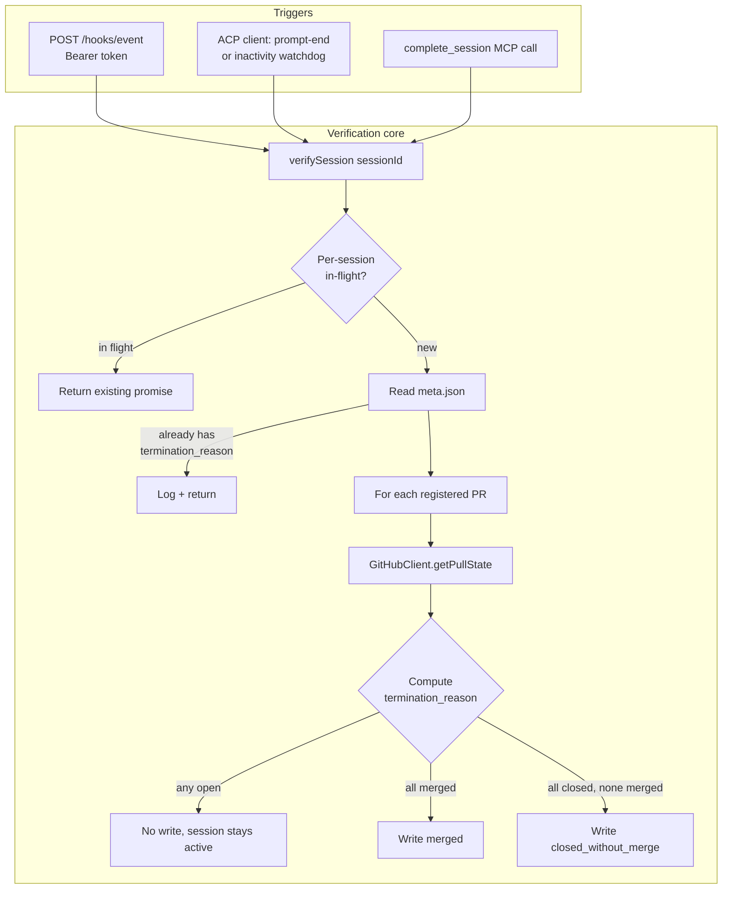

# Design: Agent-Adapter Pattern + GitHub-Verified Completion Loop

## Overview

The current daemon has two architectural smells the recent bug exposed:

1. **Kiro-specific code leaks into `src/index.ts`.** The `acpSpawner` lambda hardcodes `kiroPath` and `['acp']`. Adding a second agent today would require editing the daemon entry point.
2. **Verification is one-shot and coupled to `complete_session`.** The PR-state check we just shipped works, but it only runs when the agent calls `complete_session`. There is no way to trigger verification from anywhere else — a hook event, an ACP signal, a cron tick, a manual probe.

The fix is two layers:

- An **`AgentAdapter` interface** with one concrete implementation. Pure refactor, no behavior change for current users.
- A **`verifySession(sessionId)` core** plus a handful of trigger surfaces (HTTP endpoint, ACP signals, the existing `complete_session` MCP path). All triggers funnel into the same routine. The routine is the source of truth for terminal-state writes.

The original spec also included automatic hook installation into `~/.kiro/agents/agent-router.json` and a system-prompt mutation that tells the agent to use `merge_pr`. Both were deferred after discussion — the ACP-layer fallback delivers correctness, and agent-router's async-primary usage model means seconds of post-merge latency are irrelevant. The hook-installation file gets a stub and a documentation page; future PRs can wire the real installer if real usage shows the latency win matters.

### Design Decisions

| Decision | Choice | Rationale |
|----------|--------|-----------|
| Verification trigger surface | HTTP endpoint + ACP signals + MCP `complete_session` | Pluggable — anything that knows a session-id can fire verification. The HTTP endpoint is the universal seam for future adapters and hand-installed hooks. |
| Verification authority | GitHub API state, never agent claims | This is the structural fix for the 95a59ed3 class of bugs. Agents cannot lie about `termination_reason` because they never write it. |
| Token generation | Regenerate-on-start, written to `$rootDir/daemon-token` (0600) | Restarts naturally invalidate stale hooks. No persistent secret. Hand-installed hooks read the file at fire time, so they survive restarts without manual update. |
| Token transport | Bearer header, never URL query string | Standard. Avoids logging the token in nginx access logs. |
| `installHooks` in `KiroAdapter` | Documentation-only stub | Deferred — see above. The interface lives so the real installer is a one-method addition later. |
| `verifySession` concurrency | Per-session single-flight via `Map<sessionId, Promise>` | Multiple triggers (hook + ACP fallback + complete_session) can fire within milliseconds. Single-flight is the simplest dedup. |
| Inactivity-watchdog before verify | Yes — verify *before* killing the subprocess | If the agent has finished its work and is idle waiting for cleanup, verification may transition the session to `completed` instead of `failed:timeout_inactivity`. Strictly better outcome. |
| Inactivity-watchdog GitHub-outage path | Reset the watchdog (don't write timeout_inactivity) when verifySession returns `{verified: false, reason: 'github_error'}` | A transient GitHub outage during the watchdog window could otherwise mark a successful session as failed:timeout_inactivity. Cost is one extra inactivity cycle; benefit is no false failures during outages. |
| Per-request GitHub timeout | 5 seconds via `AbortController` | A hung GitHub response would deadlock the inactivity watchdog (which now awaits verification before killing). Bounded budget is mandatory. |
| ACP "turn-end" trigger source | The JSON-RPC response to `session/prompt` (i.e., post-`sendPrompt` resolution), NOT a streaming notification | Investigation of `src/acp.ts` showed no streaming turn-end marker is surfaced. The `session/prompt` JSON-RPC response is the actual turn-end signal the daemon can observe today. |
| `merge_pr` 405 handling | Try-then-verify | 405 from GitHub on merge is ambiguous: it can mean "already merged" or "blocked by branch protection." The state query disambiguates. |
| Post-merge polling | 10×300ms = 3s budget | GitHub typically reflects the merge in <1s. 3s covers the long tail without making merge a synchronous-3-second operation. |
| Polling delay configurable | Yes, via `GitHubClientOptions.pollIntervalMs` | Unit tests need ms-not-seconds. Production uses the 300ms default. |

### Scope Boundaries

**This feature covers:**
- HTTP `/hooks/event` endpoint, authenticated.
- `verifySession(sessionId)` core in `src/session-mgr.ts` (or extracted to `src/verify-session.ts` if it grows large).
- `AgentAdapter` interface in `src/agent-adapter.ts`.
- `KiroAdapter` concrete implementation in `src/adapters/kiro.ts` (spawn only).
- ACP-layer wiring: prompt-end and inactivity-watchdog both trigger `verifySession`.
- `merge_pr` idempotency on 405 + post-merge polling.
- `docs/kiro-hooks.md` documenting the hook payload format and a copy-pasteable example.

**Explicitly excluded:**
- Automatic mutation of `~/.kiro/agents/agent-router.json`.
- Automatic agent-profile prompt updates.
- Other adapters (Claude Code, OpenCode, Codex).
- Cron mode activation.

## Architecture



### End-to-End Flow (the cron/hidden mode path)

1. Webhook arrives → daemon spawns a session via `KiroAdapter.spawn`.
2. Agent does work, registers a PR via `register_pr`, calls `merge_pr` to squash-merge.
3. `merge_pr` returns 200; the polling loop in the client confirms `merged: true` within ~1s.
4. Agent calls `complete_session` → daemon dispatches to `verifySession` → GitHub reports merged → `termination_reason: 'merged'` written to `meta.json`.
5. Even if step 4 doesn't happen, the **ACP fallback** fires: when the agent's turn ends or the inactivity watchdog expires, `verifySession` runs anyway. Same outcome.
6. The HTTP `/hooks/event` endpoint isn't strictly needed for Kiro today (no hooks installed), but exists so any future hook (hand-installed or via a future adapter) can short-circuit the seconds-of-latency wait.

## Components

### 1. Hooks HTTP Endpoint — `src/server.ts`

Adds one route to the existing Hono app:

```typescript
app.post('/hooks/event', async (c) => {
  const auth = c.req.header('Authorization');
  if (auth !== `Bearer ${tokenStore.read()}`) {
    return c.json({ error: 'unauthorized' }, 401);
  }
  const body = await c.req.json().catch(() => null);
  if (!body || typeof body.session_id !== 'string') {
    return c.json({ error: 'invalid body' }, 400);
  }
  // Fire-and-forget: respond immediately, verify asynchronously.
  void verifySession(body.session_id).catch(err => log.error('verifySession failed', { err }));
  return c.json({ accepted: true }, 202);
});
```

**Token store:** A small helper (`src/daemon-token.ts`) that:
- On daemon start: generates 32 random bytes, hex-encodes, writes to `$rootDir/daemon-token` with mode `0600`, exposes `read()` returning the current token.
- Caches the token in memory; doesn't re-read on every request.

### 2. verifySession — `src/verify-session.ts`

```typescript
export type VerifyResult =
  | { verified: true; termination_reason: 'merged' | 'closed_without_merge' }
  | { verified: false; reason: 'github_error'; error: string }
  | { verified: false; reason: 'prs_still_open' }
  | { verified: false; reason: 'already_verified' }
  | { verified: false; reason: 'no_prs' };

export function createVerifier(deps: {...}): (sid: string) => Promise<VerifyResult> {
  const inFlight = new Map<string, Promise<VerifyResult>>();

  return async function verifySession(sessionId: string): Promise<VerifyResult> {
    const existing = inFlight.get(sessionId);
    if (existing) return existing;

    const p = (async (): Promise<VerifyResult> => {
      if (!sessionFiles.sessionExists(sessionId)) {
        return { verified: false, reason: 'no_prs' };
      }
      const meta = sessionFiles.readMeta(sessionId);
      if (meta.termination_reason) {
        log.debug('verifySession: already verified', { sessionId });
        return { verified: false, reason: 'already_verified' };
      }
      if (meta.prs.length === 0) {
        log.info('verifySession: no registered PRs, skipping');
        return { verified: false, reason: 'no_prs' };
      }

      const states = [];
      for (const pr of meta.prs) {
        const [owner, name] = splitRepo(pr.repo);
        try {
          states.push(await github.getPullState(owner, name, pr.pr_number));
        } catch (err) {
          const msg = err instanceof Error ? err.message : String(err);
          log.error('verifySession: GitHub query failed', { sessionId, pr, error: msg });
          sessionFiles.appendStream(sessionId, {
            ts: nowIso(), source: 'router',
            type: 'verification_failed',
            error: msg,
          });
          return { verified: false, reason: 'github_error', error: msg };
        }
      }

      if (states.some(s => s.state === 'open')) {
        return { verified: false, reason: 'prs_still_open' };
      }

      const reason = states.every(s => s.merged) ? 'merged' : 'closed_without_merge';
      sessionFiles.updateMeta(sessionId, {
        status: 'completed',
        completed_at: nowSecs(),
        termination_reason: reason,
      });
      sessionFiles.appendStream(sessionId, {
        ts: nowIso(), source: 'router',
        type: 'session_verified',
        termination_reason: reason,
        prs: meta.prs.map(p => ({ repo: p.repo, pr_number: p.pr_number })),
      });
      return { verified: true, termination_reason: reason };
    })();

    inFlight.set(sessionId, p);
    try { return await p; } finally { inFlight.delete(sessionId); }
  };
}
```

**Key design points:**
- The function is *trigger-agnostic*. It doesn't know who called it.
- It is *write-idempotent*. The `termination_reason` check at the top dedupes.
- It is *concurrency-safe*. The `inFlight` map removes entries on settlement so the map stays bounded.
- It does *not* throw on network errors — returns a structured result. Callers (especially the inactivity watchdog) read `result.reason` to distinguish "PRs still open" from "GitHub is down" — the former is a real timeout-eligible signal, the latter is not.
- A `verification_failed` stream entry is appended on every GitHub error so the failure mode is observable.

### 3. AgentAdapter Interface — `src/agent-adapter.ts`

```typescript
export type HookEventType = 'session.start' | 'tool.post' | 'turn.end' | 'session.end';

export interface AdapterCapabilities {
  events: ReadonlyArray<HookEventType>;
  perToolMatching: boolean;
}

export interface SpawnOpts {
  sessionId: string;
  env?: Record<string, string>;
}

export interface AgentAdapter {
  readonly name: string;
  capabilities(): AdapterCapabilities;
  spawn(opts: SpawnOpts): ACPClient;
  installHooks(daemonUrl: string, token: string): Promise<void>;
  uninstallHooks(): Promise<void>;
}
```

That's the entire interface. Concrete implementations live in `src/adapters/<name>.ts`.

### 4. KiroAdapter — `src/adapters/kiro.ts`

```typescript
export function createKiroAdapter(deps: {
  kiroPath: string;
  log: Logger;
}): AgentAdapter {
  return {
    name: 'kiro',
    capabilities: () => ({
      events: ['session.start', 'tool.post', 'turn.end', 'session.end'],
      perToolMatching: true,
    }),
    spawn(opts) {
      return spawnACPClient(deps.kiroPath, ['acp'], {
        ...(opts.env ?? {}),
        AGENT_ROUTER_SESSION_ID: opts.sessionId,
      });
    },
    async installHooks(_daemonUrl, _token) {
      deps.log.info(
        'KiroAdapter.installHooks is documentation-only in this version; see docs/kiro-hooks.md',
      );
    },
    async uninstallHooks() {
      // no-op
    },
  };
}
```

Behavior of `spawn` is **byte-identical** to the current `acpSpawner` lambda. Only the encapsulation changes.

### 5. ACP Fallback Wiring — `src/session-mgr.ts`

Two integration points, both inside `createSessionManager`. The pre-flight investigation of `src/acp.ts` confirmed there is **no streaming turn-end marker** surfaced today — the original spec's "ACP prompt-end notification" doesn't exist. The realistic equivalent is the JSON-RPC response to `session/prompt`, which is what `await acp.sendPrompt(...)` resolves on.

**A. Post-`sendPrompt` → verify.** Wire `injectPrompt`: after `await handle.acp.sendPrompt(prompt)` resolves, fire `void verifySession(sessionId)`. The agent has finished processing the daemon-injected prompt at the protocol level — that's the strongest "turn-end" signal observable today. Fire-and-forget; single-flight handles dedup against the hook path or `complete_session`.

```typescript
async injectPrompt(sessionId, prompt, source) {
  const handle = registry.get(sessionId);
  if (!handle) throw new Error(`No active session: ${sessionId}`);
  await handle.acp.sendPrompt(prompt);
  sessionFiles.appendPrompt(sessionId, source, prompt);
  sessionFiles.appendStream(sessionId, {...prompt_injected entry});
  // New: post-prompt verify trigger
  void verifySession(sessionId).catch(err => log.error('post-prompt verify failed', { err }));
}
```

**B. Inactivity watchdog → verify-first with outage protection.** The inactivity timer (`resetInactivityTimer`) currently writes `termination_reason: 'timeout_inactivity'` and kills the subprocess. Modify to:

```typescript
const result = await verifySession(sessionId);
switch (result.verified) {
  case true:
    // termination_reason already written — skip timeout-failed write, proceed to kill
    break;
  case false:
    if (result.reason === 'github_error') {
      // GitHub outage — DO NOT mark timeout_inactivity. Reset watchdog for another cycle.
      log.warn('inactivity watchdog: GitHub error, resetting watchdog');
      resetInactivityTimer(sessionId, acp);
      return; // crucial: do not fall through to timeout-failed
    }
    // prs_still_open | no_prs | already_verified → existing timeout-failed path
    sessionFiles.updateMeta(sessionId, { status: 'failed', termination_reason: 'timeout_inactivity', completed_at: nowSecs() });
    break;
}
// proceed with kill...
```

This pattern protects against the false-failure window: during a transient GitHub outage, the watchdog grants another inactivity cycle rather than flipping a successful session into a timeout failure. The cost is at most one extra inactivity-window's worth of held-open subprocess; the upside is correctness under transient failure.

Net result for the agent: an agent that completes its work and goes idle becomes `completed:merged` instead of `failed:timeout_inactivity`, and the same agent during a GitHub outage doesn't get falsely marked failed — it gets another chance.

### 6. merge_pr Hardening — `src/github.ts`

Three surgical changes inside `mergePullRequest` and the request helper:

**`PullState` gains `mergeCommitSha`:**

```typescript
export interface PullState {
  number: number;
  state: 'open' | 'closed';
  merged: boolean;
  mergeCommitSha: string | null;  // from GitHub's merge_commit_sha
}
```

This is a one-field extension to capture the SHA GitHub already returns on every GET. Used by the already-merged response path so it carries a real SHA instead of empty string.

**Idempotency on 405:**

```typescript
try {
  data = await request('PUT', `/repos/${owner}/${repo}/pulls/${prNumber}/merge`, body);
} catch (err) {
  if (err instanceof GitHubApiError && err.status === 405) {
    const state = await this.getPullState(owner, repo, prNumber);
    if (state.merged) {
      return { sha: state.mergeCommitSha ?? '', merged: true, message: 'already merged' };
    }
  }
  throw err;
}
```

**Post-merge confirmation:**

```typescript
// After PUT returns 200 with merged:true, poll until visible in GET.
for (let i = 0; i < pollAttempts; i++) {
  const state = await this.getPullState(owner, repo, prNumber);
  if (state.merged) {
    return { sha: state.mergeCommitSha ?? sha, merged: true, message };
  }
  await sleep(pollIntervalMs);
}
log.warn('merge_pr: post-merge poll exhausted before state==merged; returning original response');
return { sha, merged: true, message };
```

**Per-request timeout via `AbortController`:**

```typescript
async function request(method, path, body) {
  const ac = new AbortController();
  const timer = setTimeout(() => ac.abort(), requestTimeoutMs);
  try {
    const res = await fetchImpl(`${baseUrl}${path}`, { ..., signal: ac.signal });
    // ...
  } catch (err) {
    if (err.name === 'AbortError') {
      throw new GitHubApiError(`request timeout after ${requestTimeoutMs}ms`, 0, '');
    }
    throw err;
  } finally {
    clearTimeout(timer);
  }
}
```

All three configurable via `GitHubClientOptions`: `pollAttempts`, `pollIntervalMs`, `requestTimeoutMs`. Defaults: 10, 300ms, 5000ms. Tests use small values to keep them fast.

## Data Models

### Hook event payload (POST body)

```typescript
interface HookEventBody {
  event_type: 'session.start' | 'tool.post' | 'turn.end' | 'session.end';
  session_id: string;
  agent_name?: string;
  tool_name?: string;
  tool_input?: unknown;
  tool_response?: unknown;
  timestamp?: string;
}
```

Only `session_id` is required for dispatch. Everything else is logged for forensics; the trigger semantics are the same regardless of `event_type`.

### Stream entry for verification

```typescript
{
  ts: '2026-05-20T20:00:00.000Z',
  source: 'router',
  type: 'session_verified',
  termination_reason: 'merged' | 'closed_without_merge',
  prs: [{ repo: 'agent-router/repo', pr_number: 59 }, ...]
}
```

## Correctness Properties

### Property 1: Idempotency

*For any* number of consecutive `verifySession(s)` calls (regardless of trigger source), `meta.json` for session `s` SHALL be written at most once with a `termination_reason` field.

**Validates: Requirement 2.7, 2.9**

### Property 2: Authority

*For any* session terminal state recorded in `meta.json`, the `termination_reason` value SHALL be computable solely from the set of `getPullState` results at the moment of the write. No agent-provided field SHALL influence it.

**Validates: Requirement 2.4, 2.5, 2.6**

### Property 3: Liveness via ACP fallback

*For any* session that successfully merges a registered PR but never receives a hook event AND never has `complete_session` called, the session SHALL transition to `completed:merged` within the inactivity-watchdog window (default 5 minutes).

**Validates: Requirement 5.1, 5.2**

### Property 4: Unauthorized rejection

*For any* `POST /hooks/event` request missing or carrying the wrong bearer token, the daemon SHALL respond `401` AND SHALL NOT invoke `verifySession`.

**Validates: Requirement 1.3**

### Property 5: merge_pr idempotency

*For any* call to `mergePullRequest` against an already-merged PR, the call SHALL return a successful `MergeResult` rather than throwing.

**Validates: Requirement 6.1**

## Error Handling

| Error Condition | Behavior |
|-----------------|----------|
| Daemon token file missing on read | Regenerate, log warning. |
| Hook POST with bad JSON | 400 with `{ error: 'invalid body' }`. |
| Hook POST with valid JSON but nonexistent `session_id` | 202 (don't leak existence). `verifySession` logs at debug, returns. |
| `getPullState` throws (network, 5xx) | `verifySession` logs at error and returns without writing. Next trigger retries. |
| `verifySession` concurrent calls | Second call awaits the in-flight promise; both observe the same final state. |
| ACP `session/prompt` event with no `stopReason` | Treat as turn-end; fire verifySession. Worst case: redundant call deduped by single-flight. |
| `merge_pr` 405 + state still `open` | Re-throw the original 405 — branch protection or unmergeable state. |
| `merge_pr` 200 then state never reflects merge | Log warn, return original 200 response. Session-level verification will retry later. |

## Testing Strategy

### Tier 1 (`test/tier1/`)

- `daemon-token.test.ts` — token generation, file write permissions (0600), re-read after restart.
- `verify-session.test.ts` — verifySession against a fake GitHubClient covering all PR-state combinations + idempotency + single-flight.
- `github.test.ts` — extend existing file with: `merge_pr` 405 → already-merged success path; 405 → still-open re-throw; post-merge polling success and exhaustion.
- `agent-adapter.test.ts` — KiroAdapter constructs, returns expected capabilities, `spawn` delegates correctly (verifiable via spy on the spawn fn injected as a dep).

### Tier 2 (`test/tier2/`)

- `hooks-endpoint.test.ts` — POST `/hooks/event` with right/wrong/missing token, valid/invalid body. Verifies `verifySession` is called via spy or via observable side effect (meta.json write).
- `acp-fallback.test.ts` — Drive a session through the fake Kiro ACP harness; assert verifySession fires on prompt-end and on inactivity-watchdog expiry.

### Existing test updates

- `test/tier2/session-mgr.test.ts` and `test/tier2/cli-server.test.ts` construct a `sessionMgr` with a stub adapter (or `KiroAdapter` wired to the fake Kiro backend) instead of the inline `acpSpawner`. Minimal surface change.

## Rollout Plan

1. Land this PR on `fix/merge-pr-completion-validation` (continuing the same feature branch as the prior bug fix).
2. After merge, restart the daemon — the new token file is created on first start.
3. Manual smoke test: trigger a session via webhook, observe `verifySession` firing in logs when the agent merges or when inactivity expires.
4. Optional follow-up PR: implement the real `KiroAdapter.installHooks` once latency wins justify the surgery in `~/.kiro/agents/agent-router.json`.

## Success Metric

A session that opens a PR, merges it, and goes idle reaches `completed:merged` status without any human intervention. Today this requires the agent to call `complete_session` correctly; after this work, the ACP fallback guarantees it.

**Baseline today:** Agents that forget to call `complete_session` (or get it wrong) hang in `active` until the inactivity-watchdog forces `failed:timeout_inactivity` — losing the signal that the work succeeded.

**Target:** 100% of sessions with at least one registered PR reach a `verified` terminal state, with the `termination_reason` reflecting actual GitHub state.
