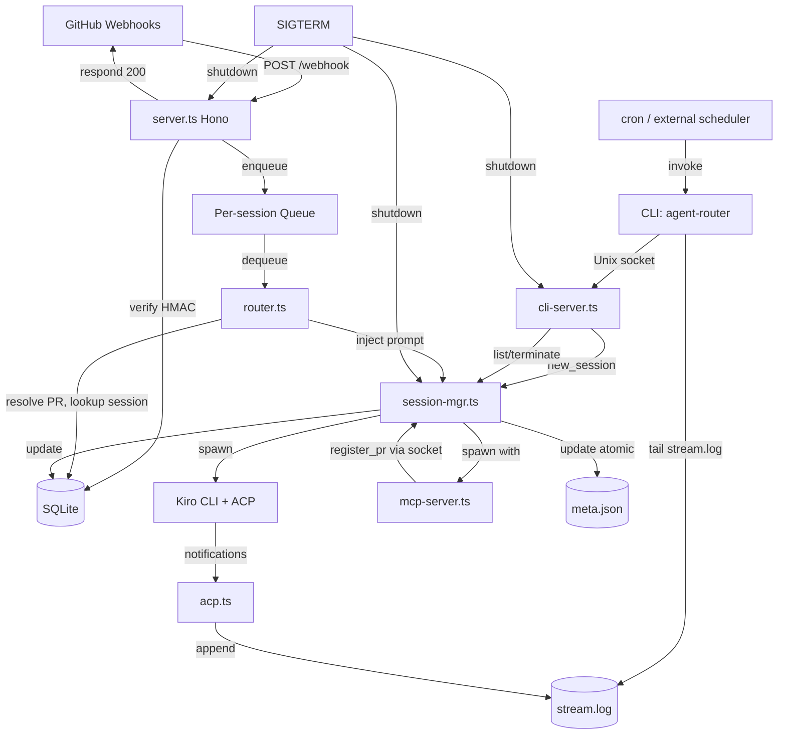

# Design Document: Agent Router

## Overview

Agent Router is a single-user TypeScript daemon that bridges GitHub events to ACP-compatible coding agents. It receives GitHub webhooks (and fires cron triggers), applies a multi-stage wake policy to decide whether an event warrants agent attention, and — when it does — spawns a Kiro CLI subprocess over stdio using the Agent Client Protocol (JSON-RPC 2.0). All session activity is streamed to append-only NDJSON files on disk, enabling CLI clients to tail output, list sessions, and inject prompts via a Unix domain socket. An MCP server process is spawned alongside each agent session, giving the agent tools to register PRs and signal completion back to the daemon.

The system is intentionally simple: one HTTP endpoint, per-session event queues, file-based streaming, one SQLite database. This design prioritizes correctness and debuggability over throughput, which is appropriate for a single-developer MVP that will later be rewritten in Rust.

### Key Design Decisions

1. **Hono on Node.js** — Lightweight HTTP framework with first-class TypeScript support, clean 404/405 middleware, and native Node.js http.createServer integration via @hono/node-server for server.close() graceful shutdown. Chosen over raw http to avoid hand-rolling the 405-with-Allow-header requirement.
2. **better-sqlite3 (synchronous)** — Synchronous API avoids callback complexity. WAL mode allows the HTTP handler to insert event rows while the worker reads them. All DB operations happen on the main thread since the worker is sequential anyway.
3. **In-memory FIFO queue** — A simple array-based queue. Events are enqueued before the HTTP response is sent. The worker drains the queue sequentially. No need for Redis or external queues for a single-user daemon.
4. **ACP over stdio** — The daemon acts as an ACP client, spawning Kiro CLI with `['acp']` args. Communication uses newline-delimited JSON-RPC 2.0 over stdin/stdout. The daemon manages the full session lifecycle: `initialize` → `session/load` → `session/prompt` → read notifications → close.
5. **File-based session streaming** — All session activity is written to append-only NDJSON files (`stream.log`, `prompts.log`) with synchronous flush. CLI clients tail these files independently. `meta.json` is atomically rewritten via temp-file-plus-rename.
6. **Unix domain socket for CLI IPC** — Separates CLI communication from the webhook HTTP server. Different security model (filesystem permissions vs. HMAC), different protocol, different lifecycle.
7. **Per-session event queues** — Each active session has its own queue and worker, preserving per-session FIFO ordering without cross-session head-of-line blocking. Multiple sessions process events in parallel.

### Source File Layout

```
src/
├── index.ts          # Entry point: load config, init, orchestrate shutdown
├── config.ts         # Config loading, ENV: resolution, validation
├── db.ts             # SQLite schema init, prepared statements, query helpers
├── log.ts            # Structured JSON logger (daemon.log destination)
├── session-files.ts  # NEW: Session directory layout, atomic meta writes, NDJSON append
├── server.ts         # Hono app: POST /webhook, signature verification
├── cli-server.ts     # NEW: Unix socket listener for CLI IPC
├── queue.ts          # Per-session event queues + sequential per-session workers
├── session-mgr.ts    # NEW: Session lifecycle (spawn, inject, terminate)
├── router.ts         # Wake policy: event type filter → PR resolution → session lookup
├── acp.ts            # ACP client: spawn, initialize, session/load, session/prompt
├── prompt.ts         # Prompt composition for each event type
└── mcp-server.ts     # NEW: MCP server spawned per session, handles register_pr et al
```

Three new files (`session-files.ts`, `cli-server.ts`, `session-mgr.ts`, `mcp-server.ts`), one existing file (`cron.ts`) removed.

#### Parallel Test Tree

```
test/
├── harness/
│   ├── interfaces.ts         # GitHubBackend, KiroBackend, CliBackend, TestDaemon
│   ├── fake-github.ts        # FakeGitHubBackend: HTTP server + Local_Git_Fixture
│   ├── fake-kiro.ts          # FakeKiroBackend: scriptable ACP subprocess
│   ├── real-github.ts        # RealGitHubBackend: wraps api.github.com
│   ├── real-kiro.ts          # RealKiroBackend: wraps real kiro-cli
│   ├── test-daemon.ts        # daemon wrapper with temp dirs, backend injection
│   ├── test-cli.ts           # programmatic CLI client
│   └── scripts/
│       └── make-fixture-repo.sh
├── scenarios/
│   ├── simple-echo.json
│   ├── create-pr.json
│   ├── create-pr-fix-ci-merge.json
│   ├── hang-then-exit.json
│   └── crash-mid-turn.json
├── fixtures/
│   ├── webhooks/
│   └── repos/
│       └── integration-test-repo.git/
├── tier1/
├── tier2/
└── tier3/
```

Runtime: `tsx` for dev, `node --import tsx/esm src/index.ts` for running. No separate build step for MVP. `tsc --noEmit` runs in CI for type checking only. When the Rust rewrite lands, this goes away entirely.

Testing: vitest for unit tests of pure functions: config validation, prompt composition, roadmap parsing (including round-trip), wake policy filters, HMAC signature verification. Tier 2 integration tests exercise the full daemon against fake backends via the test harness. Tier 3 tests validate against real GitHub and real Kiro. Test files live in `test/tier1/`, `test/tier2/`, and `test/tier3/`; pure-logic unit tests may also co-locate with source.

### Filesystem Layout

```
$AGENT_ROUTER_HOME (default: $HOME/.agent-router)
├── agent-router.db             # SQLite: sessions, session_prs, events
├── sock                        # Unix domain socket for CLI IPC
├── daemon.log                  # Router's own structured logs
└── sessions/
    ├── abc123/
    │   ├── meta.json           # Session state (atomic writes only)
    │   ├── stream.log          # NDJSON stream of router + agent events
    │   └── prompts.log         # NDJSON log of prompts sent to agent
    └── def456/
        └── ...
```

All files in a session directory are append-only except meta.json, which is atomically rewritten using temp-file-plus-rename. Session directories accumulate indefinitely for MVP; manual cleanup with `find ... -mtime +30 -exec rm -rf {} +` is documented in Operational Notes.

## Test Infrastructure

### Principles

1. **Three tiers with distinct costs and purposes.** Tier 1 (unit/property) tests exercise a single module in isolation and run in milliseconds. Tier 2 ("mocked integration") tests exercise the full daemon against fake backends and run in seconds with no network. Tier 3 ("real integration") tests exercise the full daemon against real GitHub and real Kiro and run in minutes with real API tokens.
2. **Backend interfaces, not mocks.** The test harness defines `GitHubBackend` and `KiroBackend` interfaces. Fake and real implementations both satisfy the same interface, so the same test assertions can run against either backend.
3. **Fakes with real substrate.** `FakeGitHubBackend` performs real git operations against a local bare repository. `FakeKiroBackend` runs a real Node subprocess speaking ACP JSON-RPC. The fakes are not in-memory simulations — they exercise real I/O paths.

### GitHubBackend Interface

```typescript
interface GitHubBackend {
  start(): Promise<void>;
  stop(): Promise<void>;
  reset(): Promise<void>;
  apiBaseUrl(): string;
  webhookTargetUrl(): string;
  cloneUrl(repo: string): string;
  sendWebhook(event: WebhookEvent): Promise<void>;
  createInitialPR(repo: string, branch: string, title: string, body: string): Promise<number>;
  addComment(repo: string, prNumber: number, body: string, actor: string): Promise<void>;
  reportCheckRun(repo: string, prNumber: number, name: string, conclusion: 'success' | 'failure'): Promise<void>;
  getAPICalls(): Promise<APICall[]>;
  getPRState(repo: string, prNumber: number): Promise<PRState>;
  getAllPRs(repo: string): Promise<PRSummary[]>;
}
```

### KiroBackend Interface

```typescript
interface KiroBackend {
  spawnConfig(): { command: string; args: string[]; env: Record<string, string> };
  loadScenario(scenarioPath: string): Promise<void>;
  getActions(sessionId: string): Promise<AgentAction[]>;
  reset(): Promise<void>;
}
```

### FakeGitHubBackend

HTTP server implementing a subset of the GitHub REST API sufficient for the daemon's needs:

- **Git layer:** All git operations (clone, push, fetch, merge) run as real `git` commands against the Local_Git_Fixture bare repository at `test/fixtures/repos/integration-test-repo.git`. PR branch creation and merge are real git ref operations.
- **GitHub product layer:** In-memory state for concepts that don't exist in bare git: pull request records (number, title, body, state, head/base refs), comment threads, check run history, review state, webhook delivery history, and installation identity.
- **Webhook signing:** Outbound webhooks are signed with HMAC-SHA256 using the test webhook secret, matching GitHub's `X-Hub-Signature-256` format.
- **API call recording:** Every API call received by the fake server is recorded with method, path, headers, and body for assertion in tests.
- **Clone URLs:** Exposes `file://` URLs pointing to the Local_Git_Fixture so that `git clone` operations performed by the agent succeed without network access.

### FakeKiroBackend

A Node subprocess that speaks ACP JSON-RPC over stdio, with behavior driven by a Scenario_Script:

- **Scenario loading:** Reads a scenario JSON file path from the `FAKE_KIRO_SCENARIO` environment variable at startup.
- **ACP protocol:** Responds to `initialize`, `session/load`, and `session/prompt` requests per the ACP spec. Emits `session/notification` messages as scripted.
- **Deterministic behavior:** Each scenario step specifies a trigger (request method) and a sequence of responses/notifications to emit, enabling reproducible test runs.

```typescript
interface Scenario {
  name: string;
  steps: ScenarioStep[];
}

interface ScenarioStep {
  trigger: string;                // ACP method that triggers this step (e.g., "session/prompt")
  notifications: ACPNotificationMessage[];  // notifications to emit in order
  result?: unknown;               // result to return for the triggering request
  exitCode?: number;              // if set, exit with this code after emitting notifications
  delayMs?: number;               // optional delay before responding
}
```

### RealGitHubBackend

Wraps the GitHub REST API via Octokit for Tier 3 tests:

- **Scratch repository:** Uses a dedicated test repository. All PRs, branches, and comments created during tests are cleaned up by `reset()`.
- **Artifact cleanup:** `reset()` closes all open PRs created by the test, deletes test branches, and removes test comments.
- **Webhook delivery polling:** After sending an event that should trigger a webhook, polls GitHub's webhook delivery API with a 30-second timeout to confirm delivery.
- **Rate-limit awareness:** Detects 403 responses indicating rate limiting and fails the test with a clear message rather than retrying silently.

### RealKiroBackend

Wraps the real `kiro-cli` binary for Tier 3 tests:

- **Real spawn:** `spawnConfig()` returns the real kiro-cli path and args.
- **Scenario loading:** `loadScenario()` is a no-op — the real agent decides its own behavior.
- **Action observation:** `getActions()` parses the session's `stream.log` file to extract agent actions, matching the same format used by the fake backend.

### TestDaemon Wrapper

```typescript
interface TestDaemon {
  start(options: TestDaemonOptions): Promise<void>;
  stop(): Promise<void>;
  socketPath(): string;
  webhookUrl(): string;
  rootDir(): string;
  getDb(): Database;
  advanceClock(seconds: number): void;
}
```

The TestDaemon wraps the daemon process for test execution:

- **Temp directories:** Creates isolated temp directories for each test run (database, session files, socket).
- **Backend injection:** Accepts `GitHubBackend` and `KiroBackend` instances, wiring them into the daemon's config.
- **Clock control:** `advanceClock()` allows tests to simulate time passage for rate-limit testing without real delays.
- **Lifecycle:** `start()` launches the daemon with test config; `stop()` performs graceful shutdown and cleanup.

### Test Organization by Tier

Vitest project configuration separates tests into three projects:

- **tier1:** `test/tier1/**/*.test.ts` — Unit and property tests. No external dependencies.
- **tier2:** `test/tier2/**/*.test.ts` — Full daemon tests against fake backends. Requires Node.js and git only.
- **tier3:** `test/tier3/**/*.test.ts` — Full daemon tests against real GitHub and real Kiro. Requires `GITHUB_TOKEN`, `GITHUB_WEBHOOK_SECRET`, and `KIRO_PATH` env vars.

npm script entries:
- `npm test` → `vitest run --project tier1 --project tier2`
- `npm run test:watch` → `vitest --project tier1`
- `npm run test:integration` → `vitest run --project tier3`
- `npm run test:all` → `vitest run`

## Architecture



### Request Flow (Webhook)

1. GitHub sends `POST /webhook` with `X-Hub-Signature-256` and `X-GitHub-Event` headers
2. Hono handler extracts raw body, verifies HMAC-SHA256 against configured secret
3. On success: insert event row into `events` table, enqueue event, respond HTTP 200
4. Worker dequeues event, runs wake policy pipeline:
   - Event type filtering (check_run failure, PR review comment, /agent command)
   - PR number resolution (extract from payload per event type)
   - Session lookup (query `sessions` table for repo + PR)
   - Rate limiting (check `last_waked_at` against cooldown)
5. If all checks pass: compose prompt, spawn Kiro CLI, run ACP lifecycle
6. Update event row with `processed_at` and `wake_triggered`

### Request Flow (Cron / External Scheduler)

1. External scheduler (OS cron, systemd timer, launchd) invokes `agent-router prompt --new --quiet < prompt.txt`
2. CLI connects to daemon's Unix socket, sends `new_session` op
3. Daemon creates session directory, spawns Kiro CLI via ACP, returns session_id
4. CLI prints session_id to stdout and exits
5. Session runs independently; user can `agent-router tail <session_id>` from any terminal

## Components and Interfaces

### `config.ts` — Configuration

```typescript
interface AgentRouterConfig {
  port: number;                    // 1–65535
  webhookSecret: string;           // resolved from ENV: prefix if needed
  kiroPath: string;                // absolute path to Kiro CLI executable
  // Command_Trigger is hardcoded to "/agent" in router.ts; not configurable in MVP
  rateLimit: {
    perPRSeconds: number;          // default 60
  };
  repos: RepoConfig[];
  cron: CronConfig[];
}

interface RepoConfig {
  owner: string;
  name: string;
  roadmapPath?: string;            // path to roadmap markdown file
}

interface CronConfig {
  name: string;
  schedule: string;                // cron expression (e.g. "0 */2 * * *")
  repo: string;                    // "owner/name" matching a repos entry
}

function loadConfig(path: string): AgentRouterConfig;
function resolveEnvValues(raw: Record<string, unknown>): Record<string, unknown>;
function validateConfig(config: unknown): AgentRouterConfig; // throws on invalid
```

**Design rationale:** Config is loaded once at startup and treated as immutable. `ENV:` resolution happens during loading so the rest of the system never sees unresolved references. Validation uses explicit checks rather than a schema library to keep dependencies minimal for an MVP.

### `db.ts` — Database Layer

```typescript
interface Database {
  insertEvent(event: NewEvent): number;          // returns event row id
  updateEventProcessed(id: number, wakeTriggered: boolean): void;
  markStaleEvents(olderThanSeconds: number): void;
  findSession(repo: string, prNumber: number): Session | null;
  tryAcquireWakeSlot(repo: string, prNumber: number, cooldownSeconds: number, nowSeconds: number): boolean;
  walCheckpoint(): void;
  shutdown(): Promise<void>;                     // WAL checkpoint + close
}

interface NewEvent {
  repo: string;
  prNumber: number | null;
  eventType: string;
  payload: string;                 // raw JSON string
  receivedAt: number;              // Unix timestamp
}

interface Session {
  sessionId: string;
  repo: string;
  prNumber: number;
  lastWakedAt: number | null;
}

function initDatabase(dbPath: string): Database;
```

### `server.ts` — HTTP Server

```typescript
import { Hono } from 'hono';

function createApp(deps: {
  webhookSecret: string;
  db: Database;
  enqueue: (event: QueuedEvent) => void;
}): Hono;

function verifySignature(secret: string, payload: Buffer, signature: string): boolean;
```

The Hono app registers:
- `POST /webhook` — signature verification → event logging → enqueue → 200
- Catch-all for 404 on other paths
- Method-not-allowed middleware for non-POST on `/webhook` returning 405 with `Allow: POST`

### `queue.ts` — Event Queue & Worker

```typescript
interface QueuedEvent {
  id: number;                      // event row id from DB
  repo: string;
  prNumber: number | null;
  eventType: string;
  payload: string;
  source: 'webhook' | 'cron';
}

interface EventQueue {
  enqueue(event: QueuedEvent): void;
  startWorker(processor: (event: QueuedEvent) => Promise<void>): void;
  shutdown(timeoutSeconds: number): Promise<void>; // resolves when current event finishes or timeout
  readonly length: number;
}

function createEventQueue(): EventQueue;
```

**Design rationale:** In the new design, each active session has its own queue and its own worker, managed by SessionManager. This preserves per-session FIFO ordering without cross-session head-of-line blocking. The worker for a session processes one event at a time. Serialization is per session, not global. Multiple sessions process events in parallel.

### `log.ts` — Structured Logger

```typescript
interface Logger {
  debug(msg: string, fields?: Record<string, unknown>): void;
  info(msg: string, fields?: Record<string, unknown>): void;
  warn(msg: string, fields?: Record<string, unknown>): void;
  error(msg: string, fields?: Record<string, unknown>): void;
  child(fields: Record<string, unknown>): Logger;
}

function createLogger(level: 'debug' | 'info' | 'warn' | 'error'): Logger;
```

Log entries are newline-delimited JSON to stdout with `timestamp` (ISO 8601 UTC), `level`, `message`, and merged fields. The worker calls `log.child({ event_id })` once per event. Secret values, tokens, and full payloads are never logged.

### `router.ts` — Wake Policy

```typescript
interface WakeDecision {
  wake: boolean;
  reason: string;                  // human-readable explanation for logging
  sessionId?: string;
  prNumber?: number;
}

function evaluateWakePolicy(
  event: QueuedEvent,
  db: Database,
  config: AgentRouterConfig
): WakeDecision;

// Sub-functions exposed for testing:
function filterEventType(eventType: string, payload: unknown): boolean;
function resolvePRNumber(eventType: string, payload: unknown): number | null;
function isCommandTrigger(commentBody: string): boolean;
```

Rate-limit checking and `last_waked_at` update happen atomically via `db.tryAcquireWakeSlot` to preserve correctness if the worker model ever evolves.

The wake policy is a pure pipeline: filter → resolve PR → lookup session → rate limit. Each step either short-circuits with a "no wake" decision or passes to the next. This makes the logic easy to test in isolation.

### `acp.ts` — ACP Client

```typescript
interface ACPClient {
  initialize(): Promise<void>;     // throws on version mismatch or protocol error
  loadSession(sessionId: string): Promise<void>;
  sendPrompt(prompt: string): Promise<void>;
  readonly notifications: AsyncIterable<ACPNotification>;
  readonly sessionEnded: Promise<void>;
  close(): Promise<void>;
  kill(): Promise<void>;           // SIGTERM → wait 5s → SIGKILL
}

interface ACPNotification {
  method: string;
  params: unknown;
}

function spawnACPClient(kiroPath: string, args: string[]): ACPClient;
```

**Design rationale:** The ACP client wraps `child_process.spawn` with a bidirectional JSON-RPC connection over stdio. Agent notifications (`session/notification`) are translated into Stream_Entries and written to the session's `stream.log` via `SessionFiles.appendStream`. The client exposes notifications as an async iterable for the session manager to consume; each iteration also produces a side-effectful write to the stream log for the CLI tailers. Permission requests are auto-approved internally. Timeouts are enforced by the caller (session manager), not the ACP client itself.

### `prompt.ts` — Prompt Composition

```typescript
function composeCheckRunPrompt(payload: CheckRunPayload): string;
function composeReviewCommentPrompt(payload: ReviewCommentPayload): string;
function composeCommandTriggerPrompt(payload: IssueCommentPayload): string;
function composeCronTaskPrompt(task: string, repo: string, roadmapPath: string): string;
```

Each function extracts relevant fields from the payload and assembles a structured prompt string. These are pure functions with no side effects.

### `session-files.ts` — Session File I/O

```typescript
interface SessionFiles {
  createSession(sessionId: string, originalPrompt: string): SessionPaths;
  appendStream(sessionId: string, entry: StreamEntry): void;
  appendPrompt(sessionId: string, source: PromptSource, prompt: string): void;
  updateMeta(sessionId: string, patch: Partial<SessionMeta>): void;
  readMeta(sessionId: string): SessionMeta;
  listSessions(): SessionMeta[];
  sessionExists(sessionId: string): boolean;
}

interface SessionPaths {
  dir: string;
  meta: string;
  stream: string;
  prompts: string;
}

interface StreamEntry {
  ts: string;                    // ISO 8601 UTC
  source: 'router' | 'agent';
  type: string;
  [key: string]: unknown;
}

interface SessionMeta {
  session_id: string;
  original_prompt: string;
  status: 'active' | 'completed' | 'abandoned' | 'failed';
  created_at: number;
  completed_at: number | null;
  prs: Array<{ repo: string; pr_number: number; registered_at: number }>;
}

type PromptSource = 'cli' | 'webhook' | 'cron' | 'mcp';

function createSessionFiles(rootDir: string): SessionFiles;
```

**Design rationale:** All session-scoped file I/O flows through this module. Nothing else opens files in session directories. This gives us one place to enforce append-only semantics, atomic metadata writes, and flush-on-append behavior. The module uses Node's `fs.appendFileSync` with explicit `fsync` for stream and prompt logs, and a temp-file-plus-rename for meta updates.

### `cli-server.ts` — CLI IPC Server

```typescript
interface CliServer {
  start(): Promise<void>;
  shutdown(): Promise<void>;
}

interface CliRequest {
  op: 'new_session' | 'list_sessions' | 'inject_prompt' | 'terminate_session';
  [key: string]: unknown;
}

function createCliServer(deps: {
  socketPath: string;
  sessionMgr: SessionManager;
  sessionFiles: SessionFiles;
  log: Logger;
}): CliServer;
```

Listens on a Unix domain socket, accepts newline-delimited JSON requests, dispatches to the appropriate SessionManager method, responds with newline-delimited JSON. Handles one connection at a time for simplicity; CLI connections are short-lived so contention is not a concern for MVP.

**Design rationale:** Keeping CLI IPC on a Unix socket separates it from the webhook HTTP server. Different security model (filesystem permissions vs. HMAC), different protocol, different lifecycle.

### `session-mgr.ts` — Session Manager

```typescript
interface SessionManager {
  createSession(originalPrompt: string): Promise<SessionHandle>;
  injectPrompt(sessionId: string, prompt: string, source: PromptSource): Promise<void>;
  registerPR(sessionId: string, repo: string, prNumber: number): Promise<void>;
  terminateSession(sessionId: string): Promise<void>;
  getActiveSession(sessionId: string): SessionHandle | null;
  shutdown(): Promise<void>;
}

interface SessionHandle {
  sessionId: string;
  paths: SessionPaths;
  acp: ACPClient;
  eventQueue: EventQueue;
  kiroPid: number;
}

function createSessionManager(deps: {
  db: Database;
  sessionFiles: SessionFiles;
  acpSpawner: (sessionId: string) => ACPClient;
  log: Logger;
}): SessionManager;
```

**Design rationale:** This module owns the lifetime of every active session. It holds the in-memory map from session_id to running Kiro subprocess + ACP client + per-session event queue. When a webhook arrives, the router calls `sessionMgr.getActiveSession(...)` to get the live handle. If a session for the target PR isn't active in memory, the webhook is dropped (with a log entry) — we do not auto-resurrect old sessions in MVP.

### `mcp-server.ts` — MCP Server

```typescript
interface McpServer {
  start(): Promise<void>;
  shutdown(): Promise<void>;
}

interface McpContext {
  sessionId: string;              // from AGENT_ROUTER_SESSION_ID env var
  daemonSocket: string;           // path to daemon's Unix socket
}

function createMcpServer(ctx: McpContext): McpServer;
```

Exposed MCP tools:
- `register_pr(repo, pr_number)` → `{ ok: boolean }`
- `session_status()` → `{ original_prompt, prs, pending_event_count }`
- `complete_session(reason)` → `{ ok: boolean }`

**Design rationale:** The MCP server is a separate process spawned by Kiro as part of its MCP configuration. It reads `AGENT_ROUTER_SESSION_ID` from its environment at startup, then opens a connection to the daemon's Unix socket to forward tool calls. This architecture means the MCP server process is thin — it is a translator between MCP JSON-RPC and the daemon's internal socket protocol. All real logic lives in the daemon.

## Data Models

### SQLite Schema

```sql
-- Sessions table: maps (repo, pr_number) to ACP session IDs
CREATE TABLE IF NOT EXISTS sessions (
  id            INTEGER PRIMARY KEY AUTOINCREMENT,
  repo          TEXT NOT NULL,              -- "owner/name"
  pr_number     INTEGER NOT NULL,
  session_id    TEXT NOT NULL,
  last_waked_at INTEGER,                    -- Unix timestamp, NULL if never waked
  created_at    INTEGER NOT NULL,           -- Unix timestamp
  UNIQUE(repo, pr_number)
);

CREATE INDEX IF NOT EXISTS idx_sessions_repo_pr
  ON sessions(repo, pr_number);

-- Events table: audit log of all received webhooks
CREATE TABLE IF NOT EXISTS events (
  id              INTEGER PRIMARY KEY AUTOINCREMENT,
  repo            TEXT NOT NULL,
  pr_number       INTEGER,                  -- NULL if PR resolution fails
  event_type      TEXT NOT NULL,             -- X-GitHub-Event header value
  payload         TEXT NOT NULL,             -- raw JSON, stored unmodified
  received_at     INTEGER NOT NULL,          -- Unix timestamp
  processed_at    INTEGER,                   -- Unix timestamp, NULL until processed
  wake_triggered  INTEGER CHECK (wake_triggered IN (0, 1))  -- 1 if wake occurred, 0 if not, NULL until processed
);

CREATE INDEX IF NOT EXISTS idx_events_unprocessed
  ON events(processed_at) WHERE processed_at IS NULL;

CREATE INDEX IF NOT EXISTS idx_events_repo_pr
  ON events(repo, pr_number);
```

### Config File Schema (`config.json`)

```json
{
  "port": 3000,
  "webhookSecret": "ENV:GITHUB_WEBHOOK_SECRET",
  "kiroPath": "/usr/local/bin/kiro",
  "rateLimit": {
    "perPRSeconds": 60
  },
  "repos": [
    {
      "owner": "myorg",
      "name": "myrepo",
      "roadmapPath": "./ROADMAP.md"
    }
  ],
  "cron": [
    {
      "name": "roadmap-sweep",
      "schedule": "0 */2 * * *",
      "repo": "myorg/myrepo"
    }
  ]
}
```

### ACP Message Types (JSON-RPC 2.0)

```typescript
// Client → Agent (requests)
interface ACPRequest {
  jsonrpc: '2.0';
  id: number;
  method: string;
  params?: unknown;
}

// Agent → Client (responses)
interface ACPResponse {
  jsonrpc: '2.0';
  id: number;
  result?: unknown;
  error?: { code: number; message: string; data?: unknown };
}

// Agent → Client (notifications, no id)
interface ACPNotificationMessage {
  jsonrpc: '2.0';
  method: string;
  params?: unknown;
}

// Initialize request params
interface InitializeParams {
  protocolVersion: number;         // 1
  clientCapabilities: string[];    // ['fs.readTextFile', 'fs.writeTextFile', 'terminal']
}
```

### Error Types

```typescript
class FatalError extends Error {}   // daemon exits non-zero
class EventError extends Error {}   // log, mark event processed with wake_triggered=0, continue
class WakeError extends Error {}    // log, mark event processed with wake_triggered=1, continue
```

`index.ts` installs one top-level error handler. Configuration and DB-init errors throw `FatalError`. Malformed payloads and session-lookup failures throw `EventError`. Kiro spawn failures, ACP protocol errors, and wake timeouts throw `WakeError`.

On SIGTERM or SIGINT, `index.ts` runs the shutdown sequence in order: stop accepting HTTP requests, call `queue.shutdown(30)`, call `db.shutdown()`, exit 0. A second signal during shutdown triggers immediate exit 130 with no cleanup.


## Correctness Properties

*A property is a characteristic or behavior that should hold true across all valid executions of a system — essentially, a formal statement about what the system should do. Properties serve as the bridge between human-readable specifications and machine-verifiable correctness guarantees.*

### Property 1: ENV: Value Resolution

*For any* configuration object containing string values prefixed with `ENV:`, and a corresponding set of environment variables, resolving the configuration SHALL replace every `ENV:X` value with the value of environment variable `X`, leaving non-prefixed values unchanged.

**Validates: Requirements 1.2**

### Property 2: Unknown Paths Return 404

*For any* HTTP request to a path other than `/webhook`, the server SHALL respond with HTTP status 404 regardless of the HTTP method, request headers, or request body.

**Validates: Requirements 2.2**

### Property 3: HMAC-SHA256 Verification Correctness

*For any* (secret, payload) pair, computing the HMAC-SHA256 signature and passing it to the verification function SHALL return true; and *for any* (secret, payload, signature) triple where the signature does not match the HMAC-SHA256 of the payload with the secret, the verification function SHALL return false.

**Validates: Requirements 3.1, 3.3**

### Property 4: Event Storage Round-Trip

*For any* valid event data (repo, prNumber, eventType, payload, receivedAt), inserting the event into the Event_Log and reading it back SHALL produce a row with identical field values, including the raw JSON payload stored without modification.

**Validates: Requirements 4.1, 4.2**

### Property 5: FIFO Queue Ordering

*For any* sequence of events enqueued onto the Event_Queue, dequeuing all events SHALL produce them in the same order they were enqueued.

**Validates: Requirements 5.1**

### Property 6: Event Type Filtering

*For any* GitHub webhook event, the event type filter SHALL classify the event as wakeable if and only if it matches one of: (a) `check_run` with action `completed` and conclusion `failure`, (b) `pull_request_review_comment` with action `created`, or (c) `issue_comment` with action `created` and comment body matching `^/agent(\s|$)`. All other events SHALL be classified as not wakeable.

**Validates: Requirements 6.1, 6.2, 6.3, 6.4**

### Property 7: PR Number Resolution

*For any* wakeable event payload, the PR number resolution function SHALL: extract `pull_request.number` for `pull_request_review_comment` events; extract `issue.number` for `issue_comment` events when `issue.pull_request` is present (returning null when absent); and extract the first entry's number from `check_run.pull_requests` for `check_run` events (returning null when the array is empty).

**Validates: Requirements 7.1, 7.2, 7.3, 7.4, 7.5**

### Property 8: Atomic Rate Limit Acquisition

*For any* (lastWakedAt, now, cooldownSeconds) triple where all values are non-negative integers and now ≥ lastWakedAt, `tryAcquireWakeSlot` SHALL return false (slot not acquired) if and only if `(now - lastWakedAt) < cooldownSeconds`. When lastWakedAt is null, the function SHALL always return true (slot acquired) and atomically set `last_waked_at` to `now`.

**Validates: Requirements 9.1, 9.2, 9.3, 9.4**

### Property 9: Prompt Composition Completeness

*For any* event payload of a supported type, the composed prompt string SHALL contain all required fields: (a) for `check_run`: check run name, repo full name, PR number, and output summary; (b) for `pull_request_review_comment`: comment body, file path, diff hunk, repo full name, and PR number; (c) for `issue_comment`: comment body with `/agent` token stripped, repo full name, and PR number; (d) for cron tasks: task text, repo full name, and roadmap file path.

**Validates: Requirements 11.1, 11.2, 11.3, 11.4**

### Property 10: Roadmap Task Parsing

*For any* markdown string containing lines matching `^[-*]\s+\[\s\]` (unchecked) or `^[-*]\s+\[x\]` (checked, case-insensitive), the parser SHALL correctly classify each task line as checked or unchecked, and `findNextTask` SHALL return the first unchecked task's text content with the checkbox marker stripped.

**Validates: Requirements 14.1, 14.2, 14.3**

### Property 11: Roadmap Parse/Reconstruct Round-Trip

*For any* markdown string containing task items, parsing the task list into structured objects and reconstructing the markdown from those objects SHALL produce task items equivalent to the originals.

**Validates: Requirements 14.5**

### Property 12: Configuration Validation

*For any* configuration object, the validator SHALL accept the configuration if and only if: `port` is an integer in [1, 65535], `webhookSecret` is a non-empty string (or valid `ENV:` reference), every `repos` entry has non-empty `owner` and `name`, and every `cron` entry has a non-empty `name`, a syntactically valid cron `schedule`, and a `repo` value matching an entry in `repos`.

**Validates: Requirements 15.1, 15.2, 15.3, 15.4**

### Property 13: Log Entry Structure

*For any* log call, the emitted output SHALL be a valid JSON object on a single line containing at minimum the fields `timestamp` (ISO 8601 UTC string), `level`, and `message`. Webhook-context logs SHALL additionally contain `repo`, `pr_number`, `event_type`, and `event_id`. Wake-context logs SHALL additionally contain `session_id`, `repo`, `pr_number`, and `duration_ms`.

**Validates: Requirements 17.1, 17.2, 17.3, 17.4**

### Property 14: No Secrets in Log Output

*For any* log entry produced by the system, the serialized JSON output SHALL NOT contain the value of `webhookSecret`, any environment variable value resolved from an `ENV:` prefix, or any string matching common secret patterns (API keys, tokens, credentials).

**Validates: Requirements 17.5**

### Property 15: Log Level Filtering

*For any* configured log level L and any log entry at level E, the entry SHALL be emitted if and only if the severity of E is greater than or equal to the severity of L, where severity order is `debug < info < warn < error`.

**Validates: Requirements 17.6**

### Property 16: Stream Entry Structure

*For any* Stream_Entry written to `stream.log`, the entry SHALL be a valid single-line JSON object containing at minimum `ts` (ISO 8601 UTC), `source` (one of `router`, `agent`), and `type`.

**Validates: Requirements 19.1, 19.2**

### Property 17: Meta File Atomic Writes

*For any* `meta.json` update, readers SHALL never observe partial content. The file SHALL always contain a valid, complete JSON object representing a SessionMeta.

**Validates: Requirements 18.7**

### Property 18: Session Status Transitions

*For any* session, status transitions SHALL follow: `active` → `completed` | `failed` | `abandoned`. Non-active sessions SHALL never be modified.

**Validates: Requirements 20.4, 20.5, 20.6, 20.7**

### Property 19: Prompt Log Completeness

*For any* prompt sent to an agent, a corresponding Prompt_Entry SHALL exist in `prompts.log` with matching `ts`, `source`, and `prompt` text.

**Validates: Requirements 19.7**

### Property 20: Backend Interface Conformance

*For any* test using GitHubBackend or KiroBackend, the fake and real implementations SHALL produce equivalent observable behavior for the same sequence of operations.

**Validates: Requirements 22.1, 22.2**

### Property 21: Local Git Fixture Isolation

*For any* test suite execution, the Local_Git_Fixture SHALL be recreated fresh, ensuring no state leaks between test runs.

**Validates: Requirements 23.2, 23.3**

## Error Handling

### HTTP Layer

| Condition | Response | Action |
|---|---|---|
| Path ≠ `/webhook` | 404 Not Found | None |
| Method ≠ POST on `/webhook` | 405 Method Not Allowed + `Allow: POST` | None |
| Missing `X-Hub-Signature-256` | 401 Unauthorized | Discard request |
| Invalid HMAC signature | 401 Unauthorized | Discard request |
| Valid signature | 200 OK | Insert event, enqueue |

### Configuration Errors

All configuration errors are fatal — the daemon logs a descriptive error and exits with a non-zero code:
- Missing or unparseable `config.json`
- Missing required environment variable for `ENV:` reference
- Port out of range [1, 65535]
- Empty `webhookSecret`
- Repo entry missing `owner` or `name`
- Cron entry missing `name`, invalid `schedule`, or unmatched `repo`
- `kiroPath` not found or not executable

### Wake Policy Errors (Non-Fatal)

These conditions cause the event to be marked as processed with `wake_triggered = 0`:
- Event type does not match any wakeable pattern
- PR number cannot be resolved (missing field, empty array)
- No session registered for the repo/PR
- Rate limited (cooldown not elapsed)

### ACP / Subprocess Errors (Non-Fatal)

These conditions are logged and the event is marked as processed:
- Kiro CLI fails to spawn (`wake_triggered = 1`)
- Initialize timeout (30s) — SIGTERM → 5s → SIGKILL (`wake_triggered = 1`)
- Protocol version mismatch — close subprocess (`wake_triggered = 0`)
- Non-zero exit code (`wake_triggered = 1`)
- Max wake duration (10min) exceeded — SIGTERM → 5s → SIGKILL (`wake_triggered = 1`)

### Cron / Roadmap Errors (Non-Fatal)

- Roadmap file missing or unreadable — log error, skip trigger
- No unchecked tasks — log info, skip trigger

### Shutdown

- SIGTERM/SIGINT: close Unix domain socket listener, stop accepting HTTP requests, wait up to 30s for in-flight events
- 30s timeout: SIGTERM → 5s → SIGKILL active subprocesses
- Second SIGTERM/SIGINT: immediate SIGKILL + exit 130
- Update all active sessions' `meta.json` to `status: "abandoned"` before exit
- WAL checkpoint before exit

## Testing Strategy

### Property-Based Testing

This project uses [vitest](https://vitest.dev/) as the test runner with [fast-check](https://github.com/dubzzz/fast-check) for property-based testing in TypeScript. Each property test runs a minimum of 100 iterations with randomly generated inputs.

Property tests target the pure logic core of the system:

| Property | Module Under Test | Key Generators |
|---|---|---|
| P1: ENV resolution | `config.ts` | Random objects with `ENV:` prefixed string values |
| P2: Unknown paths → 404 | `server.ts` | Random URL path strings (excluding `/webhook`) |
| P3: HMAC verification | `server.ts` | Random byte arrays for secret and payload |
| P4: Event storage round-trip | `db.ts` | Random event data (strings, numbers, JSON objects) |
| P5: FIFO ordering | `queue.ts` | Random arrays of event objects |
| P6: Event type filtering | `router.ts` | Random event type + action + conclusion/body combos |
| P7: PR number resolution | `router.ts` | Random payloads with varying structure per event type |
| P8: Atomic rate limit acquisition | `db.ts` | Random (lastWakedAt, now, cooldown) integer triples |
| P9: Prompt completeness | `prompt.ts` | Random payload fields (strings, numbers) per event type |
| P10: Roadmap parsing | `cron.ts` | Random markdown with `- [ ]`, `- [x]`, `* [ ]` lines |
| P11: Roadmap round-trip | `cron.ts` | Random task lists → markdown → parse → compare |
| P12: Config validation | `config.ts` | Random config objects with valid/invalid field values |
| P13: Log structure | `log.ts` | Random log data with various field combinations |
| P14: No secrets in logs | `log.ts` | Random log data seeded with known secret values |
| P15: Log level filtering | `log.ts` | Random (configuredLevel, entryLevel) pairs |
| P16: Stream entry structure | `session-files.ts` | Random StreamEntry objects with varying source/type/fields |
| P17: Meta file atomic writes | `session-files.ts` | Random SessionMeta objects, concurrent read/write simulation |
| P18: Session status transitions | `session-mgr.ts` | Random session lifecycle sequences (create → complete/fail/abandon) |
| P19: Prompt log completeness | `session-files.ts` | Random prompts with varying source and content |
| P20: Backend interface conformance | `test/harness/` | Same operation sequences against fake and real backends |
| P21: Local git fixture isolation | `test/harness/` | Sequential test suite executions with state assertions |

Each test is tagged with: `Feature: agent-router, Property {N}: {title}`

### Unit Tests (Example-Based)

Unit tests cover specific examples, edge cases, and error conditions not suited for PBT:

- **Config errors**: missing file, invalid JSON, missing env var (Req 1.3, 1.4)
- **HTTP routing**: 405 for each non-POST method with `Allow: POST` header (Req 2.3)
- **Signature edge cases**: missing header returns 401 (Req 3.2)
- **Stale event cleanup**: startup marks old unprocessed events (Req 5.3)
- **Session lookup**: no session → no wake (Req 8.2)
- **ACP errors**: protocol mismatch, spawn failure, non-zero exit (Req 10.4, 10.10, 10.11)
- **Roadmap edge cases**: missing file, all tasks checked (Req 13.4, 14.4)
- **Config validation failure**: descriptive error + non-zero exit (Req 15.6)
- **markTaskChecked**: replaces `[ ]` with `[x]` at specified line (Req 13)
- **Session directory creation failure**: filesystem permissions error returns error to caller (Req 18.8)
- **CLI IPC ops**: new_session, list_sessions, terminate_session, inject_prompt round-trips (Req 21.3, 21.4, 21.5, 21.7)
- **Meta.json initial state**: new session has status "active", empty prs, null completed_at (Req 20.2)
- **Shutdown marks sessions abandoned**: active sessions get status "abandoned" on daemon shutdown (Req 16.7)
- **No secrets in stream entries**: webhook secrets and tokens excluded from StreamEntry output (Req 19.6)
- **MCP tool dispatch**: register_pr, session_status, complete_session return expected results (Req 21)

### Test Organization

Tests are organized into three tiers via Vitest project configuration:

- **Tier 1** (`test/tier1/`): Unit and property tests exercising single modules in isolation. No external dependencies.
- **Tier 2** (`test/tier2/`): Full daemon tests against fake backends (FakeGitHubBackend, FakeKiroBackend). Requires Node.js and git only.
- **Tier 3** (`test/tier3/`): Full daemon tests against real GitHub and real Kiro. Requires `GITHUB_TOKEN`, `GITHUB_WEBHOOK_SECRET`, and `KIRO_PATH` env vars.

Test files in `test/tier1/` may also co-locate with source (e.g., `src/router.test.ts`) for pure-logic unit tests.


## Operational Notes

Sessions are now created via the CLI (`agent-router prompt --new`) or the Unix socket IPC. The daemon manages session directories, metadata files, and stream logs automatically.

Session directories accumulate indefinitely for MVP. Manual cleanup:
```
find ~/.agent-router/sessions -maxdepth 1 -mtime +30 -exec rm -rf {} +
```

Cron scheduling is handled by the OS. Example:
```
0 9 * * * agent-router prompt --new --quiet < /path/to/roadmap-kickoff.txt >> /var/log/agent-router-cron.log 2>&1
```

MCP server first-time setup: the user configures Kiro's MCP settings to point at the `mcp-server.ts` binary. The daemon passes `AGENT_ROUTER_SESSION_ID` to Kiro when spawning it.
