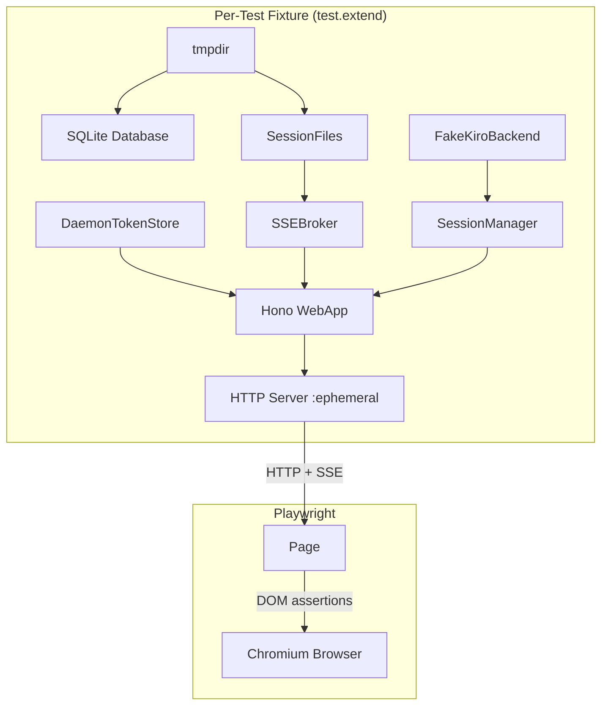
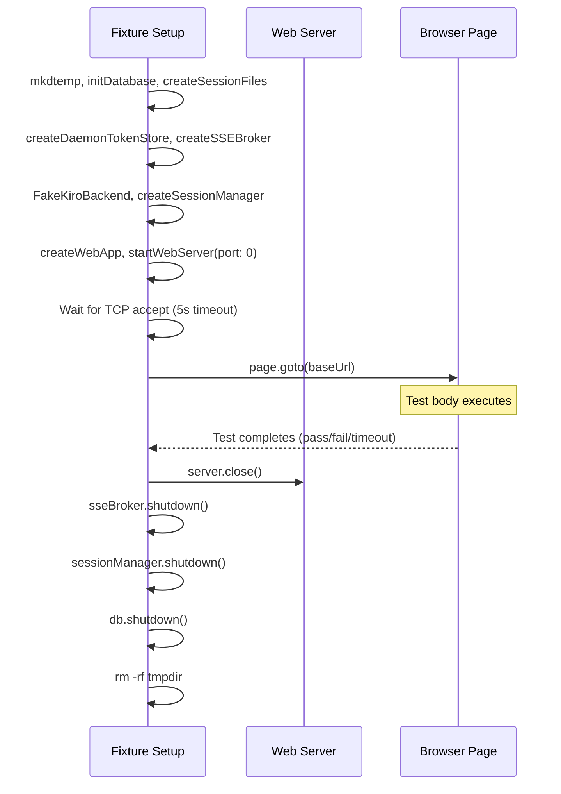

# Design Document: Browser Test Harness

## Overview

This design introduces a Playwright-based browser test tier (`test/browser/`) that launches real Chromium against an ephemeral web server instance per test. The tests exercise the browser-side JavaScript in `src/web-ui.ts` — SSE streaming, DOM rendering, hash routing, prompt injection, kill confirmation, visibility-change reconnection, and auth token embedding — behaviors invisible to HTTP-level (Tier 2) testing.

The harness reuses the existing fake backends (`FakeKiroBackend`, `createSessionFiles`, `createSSEBroker`, `createWebApp`, `startWebServer`) so tests remain fully offline and deterministic. Each test gets its own isolated environment: tmpdir, SQLite database, SSE broker, session manager, and web server on a free port.

### Key Design Decisions

1. **Module Resolution**: Playwright's built-in esbuild-based TypeScript transpilation respects the root `tsconfig.json` with `moduleResolution: "Bundler"`. Since the tsconfig is at the repo root and includes `test/**/*`, Playwright's TS handling should resolve `.js` extension imports to `.ts` files automatically — no custom loader or plugin needed. **This claim is unverified and must be proven first**: the first implementation task creates a minimal smoke test (`test/browser/smoke.spec.ts`) that imports from `../../src/web-server.js` and runs `npx playwright test` to confirm resolution works. If it fails, the fallback is Playwright's `transform` option with an explicit esbuild plugin that rewrites `.js` → `.ts` extensions.

2. **SSE Drop Simulation**: A `disconnectAll(sessionId: string): void` method is added to the SSEBroker interface. It iterates all active clients for a session, calls their `close()` callback (simulating server-initiated stream termination without writing `session_ended`), and removes them from the client map. This is clean, test-only, and doesn't require production route changes.

3. **Dialog Handling**: The web UI uses native `alert()` for error messages. The Playwright fixture provides a `ConsoleCollector` helper that auto-accepts dialogs and captures their messages for assertion. Tests asserting error paths register `page.on('dialog', ...)` before triggering actions.

4. **Auth Token Delivery**: For loopback tests (`bindPublic: false`), the token is embedded in HTML as `window.__DAEMON_TOKEN` — no Playwright header injection needed. For the `bindPublic: true` test, `page.setExtraHTTPHeaders()` injects the Authorization header.

5. **Per-Test Isolation**: Each test gets its own ephemeral tmpdir, database, SSE broker, session manager, and web server on a free port — following the pattern established in `test/tier2/web-sse.test.ts` but wrapped in Playwright's `test.extend()` fixture API.

## Architecture



### Test Lifecycle



## Components and Interfaces

### File Structure

```
playwright.config.ts              (repo root)
test/browser/
  fixtures.ts                     (Playwright test.extend with server/page fixtures)
  smoke.spec.ts                   (Module resolution verification — must pass first)
  list-view.spec.ts               (Req 2)
  detail-view.spec.ts             (Req 3)
  sse-render.spec.ts              (Req 4)
  sse-reconnect.spec.ts           (Req 5)
  inject-prompt.spec.ts           (Req 6)
  kill-session.spec.ts            (Req 7)
  visibility-reconnect.spec.ts    (Req 8)
  auth-token.spec.ts              (Req 9)
```

### playwright.config.ts

```typescript
import { defineConfig } from '@playwright/test';

export default defineConfig({
  testDir: './test/browser',
  testMatch: '**/*.spec.ts',
  timeout: 30_000,
  retries: 0,
  workers: process.env.CI ? 1 : 4,
  reporter: [['list'], ['html', { open: 'never' }]],
  use: {
    browserName: 'chromium',
    headless: true,
    trace: 'on-first-retry',
  },
});
```

**Workers note**: CI uses 1 worker to limit RAM usage (~200MB vs ~800MB for 4 concurrent Chromium instances). Local development uses 4 for faster iteration.

Playwright's built-in TypeScript transpilation uses esbuild under the hood. Since the root `tsconfig.json` specifies `moduleResolution: "Bundler"` and `module: "ESNext"`, Playwright's TS loader should resolve `.js` extension imports to `.ts` source files automatically. No additional configuration (custom loaders, plugins, or `webServer` directive) is needed — the fixture manages server lifecycle directly.

**Verification required**: The first implementation task creates `test/browser/smoke.spec.ts` that imports `createWebApp` from `../../src/web-server.js` and asserts it's a function. If `npx playwright test test/browser/smoke.spec.ts` fails with "Cannot find module", the fallback is to add a `transform` field to the Playwright config with an esbuild plugin that strips `.js` extensions before resolution.

### fixtures.ts — Playwright Fixture Interface

```typescript
import { test as base, type Page } from '@playwright/test';

interface ConsoleCollector {
  errors: string[];
  warnings: string[];
  dialogs: string[];
  pageErrors: string[];
  assertNoErrors(): void;
}

interface ServerFixture {
  baseUrl: string;
  sessionFiles: SessionFiles;
  sseBroker: SSEBroker;       // includes disconnectAll method
  sessionManager: SessionManager;
  db: Database;
  tokenStore: DaemonTokenStore;
  rootDir: string;
  token: string;
}

interface BrowserFixture {
  page: Page;
  console: ConsoleCollector;
}

export const test = base.extend<ServerFixture & BrowserFixture>({
  // ... fixture implementations
});
```

### Fixture Setup (serverFixture)

The fixture follows the same pattern as `test/tier2/web-sse.test.ts`:

1. `fs.mkdtempSync()` — ephemeral tmpdir
2. `createSessionFiles(rootDir)` — session file management
3. `initDatabase(path.join(rootDir, 'agent-router.db'))` — SQLite
4. `createLogger({ level: 'error', output: () => {} })` — silent logger
5. `createDaemonTokenStore({ rootDir, log })` — token generation
6. `createSSEBroker({ sessionFiles, rootDir, log, pollIntervalMs: 50 })` — fast polling for tests
7. `new FakeKiroBackend()` — scriptable subprocess
8. `createSessionManager(...)` — with FakeKiroBackend as spawner
9. `createWebApp(...)` — Hono app with all dependencies
10. `startWebServer(app, { controlPort: 0, port: 9999, bindPublic: false }, log)` — ephemeral port

**Port extraction**: After `startWebServer` returns the `ServerType` instance, extract the actual assigned port via `(server.address() as net.AddressInfo).port`. This is the only way to construct `baseUrl` (`http://127.0.0.1:${port}`).

**TCP readiness check**: After extracting the port, the fixture opens a TCP connection to the assigned port in a loop (50ms interval, 5s deadline). If the deadline expires, the fixture throws `Error('Server startup timeout: port ${port} not accepting connections after 5000ms')`.

**Teardown** (runs unconditionally via Playwright's fixture `use` pattern):
```typescript
await use(fixtures);
// Teardown — always runs
server.close();
sseBroker.shutdown();
await sessionManager.shutdown();
await db.shutdown();
fs.rmSync(rootDir, { recursive: true, force: true });
```

### SSEBroker Extension: disconnectAll

A new method added to the `SSEBroker` interface for test use:

```typescript
export interface SSEBroker {
  subscribe(...): string;
  unsubscribe(...): void;
  shutdown(): void;
  /** Test-only: force-close all SSE clients for a session without emitting session_ended. */
  disconnectAll(sessionId: string): void;
}
```

Implementation in `createSSEBroker` — follows the same cleanup pattern as the existing `unsubscribe()` and `shutdown()` methods (clearing client map, stopping poll timer when no clients remain, checking heartbeat state):

```typescript
disconnectAll(sessionId: string): void {
  const state = sessions.get(sessionId);
  if (!state) return;
  for (const client of state.clients.values()) {
    client.close();  // Triggers stream close in browser → reconnect logic
  }
  state.clients.clear();
  // Same cleanup as unsubscribe: stop polling when no clients, check heartbeat
  if (state.pollTimer !== null) {
    clearInterval(state.pollTimer);
    state.pollTimer = null;
  }
  // Check if any sessions still have clients for heartbeat
  // (mirrors the pattern in unsubscribe)
}
```

This calls each client's `close()` callback (which closes the HTTP response writer), causing the browser's `fetch` ReadableStream to signal `done: true` — triggering the `scheduleReconnect` path without a `session_ended` event.

### ConsoleCollector

The fixture attaches listeners before navigation:

```typescript
const collector: ConsoleCollector = {
  errors: [],
  warnings: [],
  dialogs: [],
  pageErrors: [],
  assertNoErrors() {
    const allErrors = [...this.errors, ...this.pageErrors];
    if (allErrors.length > 0) {
      throw new Error(`Unexpected errors:\n${allErrors.join('\n')}`);
    }
  },
};

// Capture console.error and console.warn
page.on('console', (msg) => {
  if (msg.type() === 'error') collector.errors.push(msg.text());
  if (msg.type() === 'warning') collector.warnings.push(msg.text());
});

// Capture uncaught JS exceptions (goes through pageerror, NOT console)
page.on('pageerror', (error) => {
  collector.pageErrors.push(error.message);
});

// Auto-accept native dialogs (alert/confirm) and capture messages
page.on('dialog', async (dialog) => {
  collector.dialogs.push(dialog.message());
  await dialog.accept();
});
```

The fixture registers **both** `page.on('console')` for `console.error` calls **and** `page.on('pageerror')` for uncaught exceptions. These are different event channels — uncaught `TypeError` or `ReferenceError` goes through `pageerror`, while explicit `console.error(...)` calls go through `console`. Both must be captured to catch the "Error: Load failed" and "NetworkError" issues seen in production.

When a test fails, Playwright's `afterEach` (via fixture teardown) appends captured errors to the test attachment for CI visibility.

### Session Seeding Helper

Tests need pre-existing sessions. The fixture exposes a `seedSession` helper:

```typescript
async function seedSession(opts: {
  status?: 'active' | 'completed' | 'abandoned';
  repo?: string;
  streamEntries?: Array<Record<string, unknown>>;
}): Promise<{ sessionId: string }>;
```

For active sessions, this uses `sessionManager.createSession()` with the FakeKiroBackend configured via a minimal scenario. For terminal sessions, it uses `sessionFiles.writeMeta()` (the existing atomic-write abstraction via temp+rename) rather than direct `fs.writeFileSync`, preserving atomicity guarantees and avoiding race conditions with concurrent readers.

## Data Models

### SSE Event (browser-side)

The browser's fetch-based SSE parser produces:
```
{ event: 'log' | 'session_ended', id: number, data: string }
```

Where `id` is the 1-indexed line number from `stream.log`.

### DOM Structure (relevant selectors)

| Selector | View | Purpose |
|---|---|---|
| `#list-view` | List | Container for session rows |
| `.session-item` | List | Individual session row |
| `.badge` | Both | Status badge |
| `.badge-green` | Both | Active status badge |
| `#detail-view` | Detail | Detail container |
| `#log-container` | Detail | SSE log entries container |
| `.log-entry` | Detail | Individual log entry |
| `#sse-status` | Detail | Connection status text |
| `.controls` | Detail | Action controls container |
| `#prompt-input` | Detail | Prompt textarea |
| `#btn-send` | Detail | Send button |
| `#btn-stop` | Detail | Stop button |
| `#btn-kill` | Detail | Kill button |
| `.confirm-overlay` | Detail | Kill confirmation modal |
| `.confirm-dialog` | Detail | Modal dialog box |
| `#confirm-kill-yes` | Detail | Confirm kill button |
| `#confirm-kill-no` | Detail | Cancel kill button |

### Test Configuration

| Setting | Value | Rationale |
|---|---|---|
| `pollIntervalMs` | 50 | Fast SSE delivery for test responsiveness |
| `heartbeatIntervalMs` | 30000 | Default; not relevant for most tests |
| Server startup timeout | 5000ms | Fail fast on port binding issues |
| Default test timeout | 30000ms | Playwright default; individual tests can override |
| Workers (local) | 4 | Parallel execution; each test is fully isolated |
| Workers (CI) | 1 | Limit RAM to ~200MB; avoid OOM on constrained runners |

## Correctness Properties

*A property is a characteristic or behavior that should hold true across all valid executions of a system — essentially, a formal statement about what the system should do. Properties serve as the bridge between human-readable specifications and machine-verifiable correctness guarantees.*

### Property 1: Server Isolation

*For any* two concurrently running browser tests, each test's web server SHALL listen on a unique ephemeral port and share no mutable state (database, session files, SSE broker, tmpdir) with the other test.

**Validates: Requirements 1.1, 10.1**

### Property 2: Cleanup Guarantee

*For any* test execution that completes (whether by pass, failure, or timeout), the fixture SHALL have closed the HTTP server, shut down the SSE broker, shut down the session manager, closed the database, and removed the temporary directory — leaving no OS resources (open ports, file handles, temp files) behind.

**Validates: Requirements 1.3**

### Property 3: SSE Ordering

*For any* sequence of N log entries appended to a session's `stream.log` file, the corresponding DOM elements rendered in `#log-container` SHALL appear in monotonically increasing SSE event ID order, where the ID of the k-th entry equals k (1-indexed line number).

**Validates: Requirements 4.2**

### Property 4: No Duplicates on Reconnect

*For any* SSE reconnection event (network drop, visibility change, or server-initiated disconnect via `disconnectAll`), after the browser reconnects and receives replayed events, no SSE event ID SHALL appear more than once in the rendered `#log-container` DOM elements.

**Validates: Requirements 4.5, 5.2, 8.3**

### Property 5: Auth Boundary

*For any* test instance, when the web server is configured with `bindPublic: false`, `page.evaluate(() => window.__DAEMON_TOKEN)` SHALL return the exact daemon token provisioned for that instance; when configured with `bindPublic: true`, it SHALL return `undefined`.

**Validates: Requirements 9.1, 9.2**

## Error Handling

### Server Startup Failure

If the web server fails to bind its ephemeral port (e.g., OS port exhaustion), the fixture throws a descriptive error within the 5-second startup timeout. The test is marked as a fixture failure in Playwright's output, distinguishable from a test logic failure.

### Browser JavaScript Errors

Runtime JS errors are captured via two channels:
- `page.on('console')` — explicit `console.error(...)` calls in the UI code
- `page.on('pageerror')` — uncaught exceptions (TypeError, ReferenceError, network failures like "Error: Load failed")

Tests can call `collector.assertNoErrors()` to fail explicitly on unexpected errors from either channel. The fixture's teardown attaches captured errors to the test report regardless of test outcome.

### Dialog Handling Pattern

The web UI uses native `alert()` for:
- Inject failed
- Kill failed  
- Stop failed

Tests asserting these error paths verify the dialog message via `collector.dialogs` array. The fixture auto-accepts all dialogs to prevent test hangs. Tests that need to verify alert content check `collector.dialogs[0]` after the action.

### SSE Connection Errors

When the SSE stream fails (fetch rejects, response.ok is false), the browser-side code calls `scheduleReconnect()`. Tests simulate this via `sseBroker.disconnectAll(sessionId)` which triggers the browser's stream reader to see `done: true`, invoking the reconnect path.

### Flakiness Mitigation

- **Explicit waits**: Tests use `page.waitForSelector()` and `page.waitForFunction()` instead of fixed `setTimeout` delays.
- **Network idle**: For initial page load, tests wait for the list/detail view to render (selector-based) rather than `networkidle`.
- **SSE timing**: The broker's 50ms poll interval ensures events appear quickly. Tests allow 500ms tolerance for DOM rendering after event emission.

## Testing Strategy

### Test Runner Separation

Browser tests run exclusively under Playwright (`npx playwright test`). They are completely separate from the vitest suite:
- **vitest**: `test/tier1/`, `test/tier2/`, `test/tier3/` — runs via `npm test`
- **Playwright**: `test/browser/` — runs via `npm run test:browser`

The `vitest.config.ts` is not modified. The `vitest` include patterns (`test/tier1/**/*.test.ts`, `test/tier2/**/*.test.ts`, `test/tier3/**/*.test.ts`) naturally exclude `test/browser/` since spec files use `.spec.ts` extension.

### Property-Based Testing

Property-based testing (PBT) via `fast-check` is NOT used in the browser test specs directly. The properties defined above are verified through Playwright browser assertions rather than fast-check generators because:

1. Browser tests have high per-iteration cost (DOM rendering, SSE streaming, network I/O)
2. The input space is constrained by the test fixtures (stream.log entries are structured JSON)
3. The properties are verified with representative examples that cover the boundary conditions

Instead, properties are verified with carefully chosen examples that exercise edge cases:
- **SSE Ordering**: Test with 1, 5, and 20+ events
- **No Duplicates**: Test reconnection at various points (beginning, middle, end of stream)
- **Auth Boundary**: Test both bindPublic values

The existing Tier 1 property tests (`test/tier1/`) already cover the pure-function SSE logic (ordering, dedup, backoff computation) via fast-check. Browser tests validate that the browser-side implementation correctly uses those primitives.

### Unit Test Coverage (Tier 1, existing)

The pure logic functions in `src/ui/logic.ts` (already extracted) are covered by existing property tests:
- `mergeEvents` — idempotence, dedup, ordering
- `trackLastEventId` — monotonic tracking
- `computeBackoff` — exponential with cap
- `statusToBadge` — exhaustive mapping

### Browser Test Coverage (new)

| Spec File | Requirements | Key Assertions |
|---|---|---|
| `list-view.spec.ts` | 2.1–2.3 | Session items render, badges correct, console errors captured |
| `detail-view.spec.ts` | 3.1–3.4 | Hash routing, metadata display, not-found handling |
| `sse-render.spec.ts` | 4.1–4.6 | Live event rendering, ordering, session_ended, auto-scroll |
| `sse-reconnect.spec.ts` | 5.1–5.5 | Drop simulation, dedup, Last-Event-ID, backoff timing |
| `inject-prompt.spec.ts` | 6.1–6.6 | Send flow, validation, error dialogs |
| `kill-session.spec.ts` | 7.1–7.5 | Confirmation modal, cancel, confirm, error path |
| `visibility-reconnect.spec.ts` | 8.1–8.4 | CDP lifecycle, reconnect, missed events, dedup |
| `auth-token.spec.ts` | 9.1–9.2 | Token embedding, header injection for public bind |

### CI Integration

The `test:browser` script is added to `package.json`:
```json
"test:browser": "npx playwright test"
```

This is NOT included in `npm test` to avoid requiring Playwright/Chromium installation for Tier 1+2 testing. It runs as a separate CI step (similar to Tier 3).

### Dependencies Added

```json
"devDependencies": {
  "@playwright/test": "^1.48.0"
}
```

After `npm install`, run `npx playwright install chromium` to download the browser binary. This is handled in CI via a setup step.
