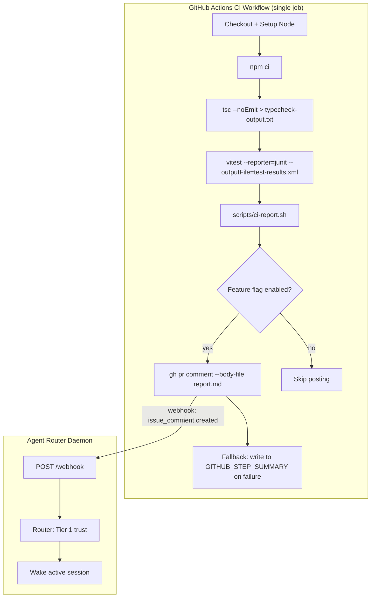
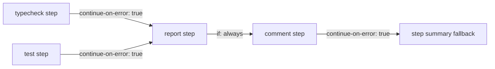

# Design Document: Structured CI Feedback

## Overview

This feature adds a structured reporting pipeline to the existing CI workflow so that when tests or typecheck fail on a PR, a machine-readable comment is posted to the PR. The agent-router daemon already routes `github-actions[bot]` comments as Tier 1 trust via `issue_comment.created` events, so this feature completes the feedback loop: CI failure → structured comment → agent wake → self-correction.

The design has four components:
1. **Workflow restructuring** — Combine the two existing jobs (`typecheck` and `test-tier1-tier2`) into a single job so all outputs are available to a final reporting step.
2. **Report builder script** — A standalone bash script (`scripts/ci-report.sh`) that parses JUnit XML and typecheck output into structured markdown.
3. **Comment posting step** — A workflow step that posts the report as a PR comment via `gh pr comment`, gated by a feature flag.
4. **Feature flag** — A GitHub Actions variable (`vars.ENABLE_PR_COMMENTS`) that gates comment posting without code changes.

### Design Decisions

| Decision | Choice | Rationale |
|----------|--------|-----------|
| Single job vs. multi-job | Single job | A reporting step needs access to files from both typecheck and tests. Artifacts between jobs add complexity and latency. A single job with sequential steps is simpler. |
| Bash script vs. TypeScript | Bash | No build step in CI. The script runs in the Actions runner where `xmllint` and standard Unix tools are available. Keeps the report builder dependency-free and fast. |
| New comment vs. edit-last | New comment | agent-router routes `issue_comment.created` events. Editing fires `issue_comment.edited` which is not routed. New comment per run is the only compatible option. |
| Truncation limit | 60,000 chars | GitHub's comment limit is 65,536 chars. 60K provides a safety margin for markdown rendering overhead. |
| JUnit XML parsing | `xmllint --xpath` | Available on all GitHub Actions runners (Ubuntu). No additional dependencies needed. Handles the vitest JUnit output format. |
| Workflow trigger | `pull_request` | Not `pull_request_target`. Agent-authored PRs are same-repo (not forks), so `pull_request` has sufficient token scope for `gh pr comment`. `pull_request_target` runs base-branch code which is a different security model — wrong for this use case. |
| Success comment posting | Yes, post on success | A one-line success comment confirms the loop is working and gives the agent a definitive "CI passed" signal. The wake cost is minimal (agent reads one line, takes no action). Suppressing success comments means the agent has no positive confirmation path. |
| Comment noise on multi-push | Post every run | Every CI run posts a new comment. Accepted cost: a PR with 10 pushes gets 10 comments. Deduplication (post-only-on-status-change) adds state tracking complexity for marginal benefit. The agent's session is already bound to the PR; redundant wakes are cheap (agent reads status, takes no action if already fixing). |
| Tier 3 inclusion | Excluded | Tier 3 runs nightly on a schedule with secrets from a protected environment. It doesn't trigger on PRs. Including it would require a separate workflow posting mechanism and conflate "code correctness" (Tier 1+2) with "integration health" (Tier 3). Separate concern, separate feature. |
| Lint/build steps | Not included | No linter (eslint) is configured in agent-router today. No build step exists (`tsx` handles execution, `tsc --noEmit` handles type checking). Nothing to report beyond typecheck + tests. |
| Comment provenance | Workflow identifier in header | The status line includes a workflow identifier: `## CI (test): ✅ ...`. This disambiguates from future workflows (deploy previews, lint-only, tier3-nightly) that might also post comments. The agent can filter by `CI (test)` prefix. |

### Scope Boundaries

**This feature covers:** PR-triggered CI only (typecheck + Tier 1/Tier 2 tests). Push-to-branch, scheduled, and manual dispatch triggers do not post comments.

**Explicitly excluded:**
- Tier 3 integration test reporting (nightly, different secrets model)
- Lint output (no linter configured)
- Build errors (no build step)
- `comment.edited` routing in agent-router
- Comment deduplication / status-change-only posting
- Fork PR support (agent PRs are same-repo)

**Cost:** None. GitHub Actions minutes are free for public repositories. agent-router is public.

## Architecture



### End-to-End Flow

1. Agent pushes a commit to a PR branch.
2. GitHub triggers the `ci.yml` workflow (`pull_request` event).
3. The workflow runs typecheck and tests as sequential steps (both execute regardless of failure via `if: always()`).
4. The report builder script reads `typecheck-output.txt` and `test-results.xml`, produces `report.md`.
5. If `vars.ENABLE_PR_COMMENTS == "true"` and the trigger is a `pull_request` event, the workflow posts `report.md` as a PR comment.
6. GitHub fires an `issue_comment.created` webhook to agent-router.
7. agent-router's wake policy classifies `github-actions[bot]` as Tier 1, resolves the PR, finds the active session, and wakes the agent.
8. The agent reads the structured comment and self-corrects.

### Step Dependency and Failure Isolation



Each step is isolated: typecheck failure doesn't prevent tests from running, test failure doesn't prevent reporting, and comment posting failure doesn't fail the workflow.

## Components and Interfaces

### 1. CI Workflow (`.github/workflows/ci.yml`)

**Restructured from two jobs to one job with sequential steps:**

| Step | Command | Outputs | Failure Handling |
|------|---------|---------|-----------------|
| checkout | `actions/checkout@v4` | — | Fatal (step fails) |
| setup-node | `actions/setup-node@v4` | — | Fatal (step fails) |
| install | `npm ci` | — | Fatal (step fails) |
| typecheck | `tsc --noEmit 2>&1 \| tee typecheck-output.txt` (with `NO_COLOR=1` env) | `typecheck-output.txt` | `continue-on-error: true` |
| test | `vitest run --project tier1 --project tier2 --reporter=default --reporter=junit --outputFile=test-results.xml` | `test-results.xml` | `continue-on-error: true` |
| report | `bash scripts/ci-report.sh ...` | `report.md` | Always runs (`if: always()`), exits 0 |
| post-comment | `gh pr comment $PR_NUMBER --body-file report.md` | — | `continue-on-error: true`, gated by feature flag + PR event |
| fallback-summary | Write report to `$GITHUB_STEP_SUMMARY` | — | Only if post-comment failed |

**Step outcome tracking:** The report step needs to know whether typecheck and tests passed or failed. GitHub Actions exposes `steps.<id>.outcome` which is `success` or `failure`. These are passed as environment variables to the report script.

### 2. Report Builder Script (`scripts/ci-report.sh`)

**Interface:**

```bash
scripts/ci-report.sh \
  --junit <path-to-junit-xml> \
  --typecheck <path-to-typecheck-output> \
  --run-link <url> \
  --typecheck-outcome <success|failure> \
  --test-outcome <success|failure> \
  --output <path-to-output-file>
```

**Arguments:**

| Argument | Required | Description |
|----------|----------|-------------|
| `--junit` | No | Path to JUnit XML file. May not exist if vitest crashed. |
| `--typecheck` | No | Path to typecheck output file. May not exist or be empty. |
| `--run-link` | Yes | Full URL to the workflow run. |
| `--typecheck-outcome` | Yes | `success` or `failure` from step outcome. |
| `--test-outcome` | Yes | `success` or `failure` from step outcome. |
| `--output` | No | Output file path. Defaults to stdout. |

**Exit code:** Always 0. The script must never fail the workflow.

**Internal logic:**

1. Determine overall status: `pass` if both outcomes are `success`, else `fail`.
2. If `pass`: emit one-line success report.
3. If `fail`: build structured failure report with sections.
4. Apply truncation if total exceeds 60,000 chars.
5. Write to output file or stdout.

### 3. Comment Format (Structured Report)

The comment format is designed for machine parsing by the agent. It uses structured markdown headers as delimiters.

**Success format:**

```markdown
## CI (test): ✅ All checks passed

[Full run details](<run-link>)
```

**Failure format:**

```markdown
## CI (test): ❌ Checks failed

**Run:** [<run-link>](<run-link>)

## Typecheck

**Status:** ❌ Failed

```
src/foo.ts(12,5): error TS2322: Type 'string' is not assignable to type 'number'.
src/bar.ts(45,10): error TS2345: Argument of type 'X' is not assignable to parameter of type 'Y'.
```

## Tests

**Status:** ❌ Failed | 42 passed, 3 failed, 0 skipped

### Failed Tests

| Test | File | Error |
|------|------|-------|
| should handle empty input | test/tier1/parser.test.ts | Expected '' to equal 'foo' |
| should validate config | test/tier2/config.test.ts | TypeError: Cannot read property... |
| should route webhook | test/tier2/webhook.test.ts | AssertionError: expected 200... |

### Failure Details

#### test/tier1/parser.test.ts > should handle empty input

```
AssertionError: expected '' to equal 'foo'
    at test/tier1/parser.test.ts:15:20
    at processTicksAndRejections (node:internal/process/task_queues:95:5)
```

#### test/tier2/config.test.ts > should validate config

<details><summary>Stack trace (2,341 chars)</summary>

```
TypeError: Cannot read property 'x' of undefined
    at validateConfig (src/config.ts:42:15)
    ...
```

</details>

---
⚠️ Report truncated (exceeded 60,000 char limit). See [full run details](<run-link>) for complete output.
```

**Format rules:**
- The first line is always `## CI (test): ✅ All checks passed` or `## CI (test): ❌ Checks failed` — this is the machine-parseable status line. The `(test)` identifier disambiguates from future workflows.
- The run link appears within the first 5 lines.
- Section headers use `## ` prefix for top-level sections (Typecheck, Tests).
- Failed test names and file paths appear in a markdown table for easy extraction.
- Stack traces are inline unless they exceed 5,000 chars, in which case they're wrapped in `<details>`.
- Truncation notice appears at the end if applied.

### 4. Feature Flag

| Variable | Location | Values | Default behavior |
|----------|----------|--------|-----------------|
| `vars.ENABLE_PR_COMMENTS` | GitHub repo settings → Variables | `"true"` to enable | Unset = disabled (no comment posted) |

The workflow checks this variable in the `if:` condition of the comment posting step. No code change or deployment needed to toggle.

### 5. Truncation Algorithm

The truncation algorithm preserves the most actionable information when the report exceeds 60,000 characters.

**Priority order (highest to lowest):**
1. Status header + run link (always preserved, ~100 chars)
2. Test summary table (failed test names, files, one-line errors)
3. Typecheck errors section (file paths + error messages)
4. Stack traces for top-N failures (up to per-section budget)
5. Remaining verbose content

**Per-section caps (applied during construction, before global truncation):**
- Typecheck section: max 20,000 chars (prevents 500-error typecheck from starving test section)
- Individual stack trace: max 5,000 chars (wrapped in `<details>` if exceeded)
- Test summary table: no cap (rows are short; even 100 failures fit in ~10K)

**Algorithm:**

```
MAX_TOTAL = 60000
TYPECHECK_MAX = 20000  (per-section cap for typecheck errors)
TRACE_MAX = 5000       (per individual stack trace)
TRUNCATION_NOTICE = "\n---\n⚠️ Report truncated..."

1. Build header (status + run link)
2. Build typecheck section (if failed)
   - If typecheck content > TYPECHECK_MAX: truncate to first N errors that fit, append "[N more errors omitted]"
3. Build test summary table (if failed)
4. Build stack trace sections, each capped at TRACE_MAX
   - If a single trace > TRACE_MAX: wrap in <details>, truncate inner content at TRACE_MAX
5. Concatenate all sections
6. If total > MAX_TOTAL:
   a. Remove stack traces from bottom up until under budget
   b. If still over: further truncate typecheck section to first 20 errors
   c. If still over: truncate test summary table to first 50 rows
   d. Append TRUNCATION_NOTICE
```

**Note on pathological cases:** With per-section caps, a 500-error typecheck output gets capped at 20K, leaving ~40K for test results. Without per-section caps, typecheck could consume the entire budget and the agent would get no test failure information. The 5K trace threshold is tunable — chosen because most TypeScript stack traces are well under 5K; only deeply nested async stacks exceed it.

## Data Models

### JUnit XML Structure (vitest output)

vitest emits JUnit XML in this structure:

```xml
<?xml version="1.0" encoding="UTF-8"?>
<testsuites name="vitest" tests="45" failures="3" errors="0" time="12.5">
  <testsuite name="test/tier1/parser.test.ts" tests="10" failures="1" time="0.5">
    <testcase name="should handle empty input" classname="test/tier1/parser.test.ts" time="0.01">
      <failure message="Expected '' to equal 'foo'" type="AssertionError">
AssertionError: expected '' to equal 'foo'
    at test/tier1/parser.test.ts:15:20
      </failure>
    </testcase>
    <testcase name="should parse valid input" classname="test/tier1/parser.test.ts" time="0.02"/>
  </testsuite>
</testsuites>
```

**Fields extracted by the report builder:**
- `testsuites/@tests` — total test count
- `testsuites/@failures` — failure count
- `testsuite/@name` — file path
- `testcase/@name` — test name
- `testcase/@classname` — file path (redundant with testsuite name)
- `testcase/failure/@message` — one-line error summary
- `testcase/failure/text()` — full stack trace

### Typecheck Output Structure

`tsc --noEmit` outputs errors in this format (with `NO_COLOR=1` set to suppress ANSI escape sequences):

```
src/foo.ts(12,5): error TS2322: Type 'string' is not assignable to type 'number'.
src/bar.ts(45,10): error TS2345: Argument of type 'X' is not assignable to parameter of type 'Y'.
```

Each line follows the pattern: `<file>(<line>,<col>): error <code>: <message>`

**ANSI escape handling:** The workflow step sets `NO_COLOR=1` in the environment to prevent `tsc` from emitting color codes. The report builder script also strips any remaining ANSI escapes defensively (`sed 's/\x1b\[[0-9;]*m//g'`) in case the env var is insufficient.

**Fields extracted by the report builder:**
- File path
- Line number
- Column number
- Error code (e.g., TS2322)
- Error message

### Report Builder Internal State

The script builds the report in sections, tracking character counts:

```
sections = [
  { type: "header", content: "## CI: ❌ ...", priority: 1 },
  { type: "typecheck", content: "## Typecheck\n...", priority: 2 },
  { type: "test_summary", content: "## Tests\n...", priority: 3 },
  { type: "trace_N", content: "#### file > test\n...", priority: 4 },
]
```

Each section has a priority. Truncation removes lowest-priority sections first.


## Correctness Properties

*A property is a characteristic or behavior that should hold true across all valid executions of a system — essentially, a formal statement about what the system should do. Properties serve as the bridge between human-readable specifications and machine-verifiable correctness guarantees.*

### Property 1: Output size invariant

*For any* combination of JUnit XML content and typecheck output (including arbitrarily large inputs), the report builder SHALL produce output that is at most 60,000 characters in length.

**Validates: Requirements 6.1**

### Property 2: Status and run link placement

*For any* failure report (where at least one of typecheck-outcome or test-outcome is "failure"), the first 5 lines of the output SHALL contain both a pass/fail status indicator and the run link URL.

**Validates: Requirements 3.1**

### Property 3: Failed test extraction completeness

*For any* valid JUnit XML containing one or more `<failure>` elements, every failed test's name, file path, and error message SHALL appear in the report output.

**Validates: Requirements 3.2**

### Property 4: Typecheck error extraction completeness

*For any* typecheck output containing one or more error lines matching the pattern `<file>(<line>,<col>): error <code>: <message>`, every error's file path, line number, and error message SHALL appear in the report output (subject to truncation, in which case the truncation notice is present).

**Validates: Requirements 3.4**

### Property 5: Details wrapping threshold

*For any* individual diagnostic section (stack trace or type error block), if its character count exceeds 5,000, it SHALL be wrapped in a `<details>` element in the output. If its character count is 5,000 or fewer, it SHALL appear inline without a `<details>` wrapper.

**Validates: Requirements 3.3, 6.4**

### Property 6: Truncation preserves priority order

*For any* input that produces a report exceeding 60,000 characters before truncation, the truncated output SHALL (a) preserve the status header and run link, (b) preserve the failure summary table with test names and file locations, and (c) contain a truncation notice with the run link.

**Validates: Requirements 6.2, 6.3**

### Property 7: Exit code invariant

*For any* input (including missing files, malformed XML, empty files, binary garbage), the report builder script SHALL exit with code 0.

**Validates: Requirements 7.5**

### Property 8: Structured section headers

*For any* failure report, all top-level content sections SHALL be delimited by `## ` markdown headers, and the report SHALL contain at least one `## ` header (the status line).

**Validates: Requirements 3.6**

## Error Handling

### Report Builder Error Cases

| Error Condition | Behavior | Output |
|----------------|----------|--------|
| JUnit XML file missing | Continue without test details | Report includes "Test results file not found" notice |
| JUnit XML malformed/partial | `xmllint` returns non-zero; fall back to grep-based extraction | Report includes "Failed to parse test results (malformed XML)" notice + any failures extractable via grep for `<failure` |
| JUnit XML empty (0 bytes) | Treat as missing | Report includes "Test results file empty" notice |
| Typecheck output file missing | Continue without typecheck details | Report includes "Typecheck output not found" notice |
| Typecheck output contains ANSI escapes | Strip via `sed` before parsing | Clean output (mitigated at source by `NO_COLOR=1` env var, but script handles it defensively) |
| Both input files missing | Produce minimal report | "CI ran but produced no parseable output" + run link |
| Typecheck output empty (success) | Omit typecheck section | No typecheck section in report |
| Stack trace exceeds 5K chars | Wrap in `<details>`, truncate inner | Collapsible section with truncation notice |
| Total report exceeds 60K chars | Apply priority truncation | Truncated report + notice |
| `xmllint` not available | Fall back to grep-based parsing | Degraded but functional report (extracts `<failure message="...">` via regex) |

### Workflow Error Cases

| Error Condition | Behavior | Workflow Impact |
|----------------|----------|----------------|
| `gh pr comment` fails (permissions) | `continue-on-error: true` | Workflow succeeds; report written to step summary |
| `gh pr comment` fails (rate limit) | `continue-on-error: true` | Workflow succeeds; report written to step summary |
| `gh pr comment` fails (GitHub outage) | `continue-on-error: true` | Workflow succeeds; report written to step summary |
| Report builder script crashes | Should not happen (exit 0 invariant) | If it does: no comment posted, workflow continues |
| Feature flag unset | Comment step skipped | Workflow succeeds normally |
| Not a PR event | Comment step skipped | Workflow succeeds normally |

### Fallback Chain

```
Primary: gh pr comment → PR comment → webhook → agent wake
Fallback: GITHUB_STEP_SUMMARY → visible in run link → human recovery only
```

**Important:** The `GITHUB_STEP_SUMMARY` fallback restores *human* visibility (Gerard can see the report in the Actions UI via the run link). It does **not** restore the agent feedback loop — no webhook fires, no agent wake occurs. If comment posting fails, the loop is broken for that run. This is acceptable because posting failures are rare (permissions misconfiguration, GitHub outage) and the next push will retry the full flow.

## Testing Strategy

### Approach

This feature has two distinct components with different testing needs:

1. **Report builder script** (`scripts/ci-report.sh`) — Pure transformation logic (inputs → output). Suitable for property-based testing.
2. **Workflow YAML** (`.github/workflows/ci.yml`) — Declarative configuration. Tested via smoke tests and manual verification.

### Property-Based Tests (Tier 1)

The report builder's core logic will be tested with property-based tests using `fast-check`. Since the script is bash, the property tests will invoke the script as a subprocess with generated inputs and verify output properties.

**Library:** `fast-check` (already a dev dependency)
**Minimum iterations:** 100 per property
**Tag format:** `Feature: structured-ci-feedback, Property N: <property text>`

Each correctness property (1–8) maps to a single property-based test that:
1. Generates random but structurally valid inputs (JUnit XML, typecheck output)
2. Invokes `scripts/ci-report.sh` with those inputs
3. Asserts the property holds on the output

**Generators needed:**
- `arbitraryJunitXml(opts)` — generates valid JUnit XML with configurable failure count, test count, trace lengths
- `arbitraryTypecheckOutput(opts)` — generates typecheck error lines with random file paths, line numbers, error codes
- `arbitraryRunLink()` — generates plausible GitHub Actions run URLs

### Unit Tests (Tier 1)

Example-based tests for specific scenarios:

| Test | Validates |
|------|-----------|
| Success report is one line with status + link | Req 4.1, 4.2 |
| Missing JUnit XML produces notice in report | Req 1.3, 7.6 |
| Missing typecheck output produces notice | Req 9.1 |
| Both files missing produces minimal report | Req 9.1 |
| Malformed XML falls back to exit code | Req 9.4 |
| Script accepts --output flag and writes file | Req 7.4 |
| Script accepts file paths as arguments | Req 7.2 |
| Run link appears in output | Req 7.3 |

### Integration Tests (Tier 2)

Not applicable for this feature. The report builder is a standalone script with no daemon interaction. The workflow YAML is tested by GitHub Actions itself when the feature ships.

### Manual Verification

Before merging:
1. Push a branch with a deliberate type error → verify comment is posted with typecheck errors
2. Push a branch with a failing test → verify comment is posted with test failure details
3. Push a branch where everything passes → verify one-line success comment
4. Set `vars.ENABLE_PR_COMMENTS` to `"false"` → verify no comment is posted
5. Verify the comment triggers agent-router wake (check daemon logs for Tier 1 classification)

### Test File Location

Property tests and unit tests for the report builder go in `test/tier1/ci-report.test.ts`.

## Rollout Plan

1. **Merge PR** with workflow changes + `scripts/ci-report.sh` + tests.
2. **Set `vars.ENABLE_PR_COMMENTS = "true"`** in GitHub repo settings → Variables.
3. **Validation push:** Push a branch with a deliberate test failure. Verify:
   - Comment appears on the PR within ~60s of CI completion.
   - Comment format matches the spec (status line, run link, failure table, stack traces).
   - agent-router daemon logs show `issue_comment.created` classified as Tier 1.
   - If an active session is bound to the PR, the agent wakes and reads the comment.
4. **Validation push (success):** Push a fix. Verify one-line success comment appears.
5. **Monitor for 1 week:** Watch for noise issues (excessive comments, agent re-processing unchanged status). Disable via feature flag if problems arise.

## Success Metric

**Primary:** Fraction of agent-opened PRs on agent-router that self-correct after CI failure without human intervention.

**Baseline:** ~0% today (agent cannot read CI output, always requires human to relay failure info).

**Target:** Agent can identify and fix at least the first CI failure cycle autonomously on >50% of its PRs within 2 weeks of launch.

**Observable success behavior:** After receiving a CI failure comment, the agent pushes a fix commit within the same session. The next CI run either passes or fails with a *different* error (progress, not repetition).

**Tracking:** Manual observation of agent-router PRs for the first 2 weeks. If the feature proves valuable, formalize into a dashboard metric later.
