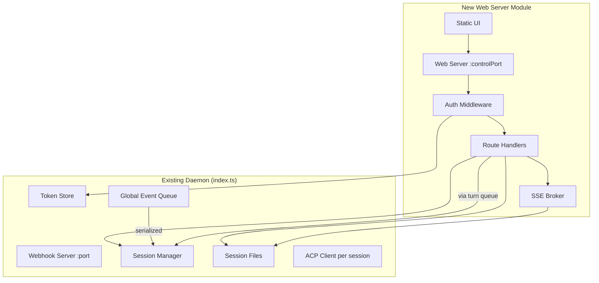

# Design Document: Web Server Control Plane

## Overview

This feature adds a second Hono HTTP server to the existing agent-router daemon, exposing session observability (list, detail, live stream) and control (inject, interrupt, kill) via REST endpoints plus a minimal single-page web UI served as static HTML. The web server runs on a separate configurable port (`controlPort`, default 3100) and integrates with the existing daemon lifecycle.

**This is not purely additive.** While the web server itself is a new module, it requires modifications to several core daemon components:

| Core touchpoint | Change | Tier 2 coverage needed |
|-----------------|--------|------------------------|
| `session-mgr.ts` | Per-session turn queue (serializes prompt delivery), extended `terminateSession` signature | Yes — concurrent inject, kill semantics |
| `acp.ts` | New `cancel()` method on `ACPClient` interface | Yes — interrupt/cancel lifecycle |
| `session-files.ts` | `PromptSource` union gains `'web'`, `TerminationReason` replaces `'terminated'` with `'terminated_cli'`/`'terminated_web'` | Yes — exhaustiveness, existing paths |
| `index.ts` | Shutdown sequence gains drain-to-completion budget, web listener lifecycle | Yes — graceful shutdown |
| `config.ts` | New config keys and validation | Yes — startup validation |

Authentication supports two paths: local bearer-token auth (reusing the existing `DaemonTokenStore`) and remote forwarded-identity auth via a vendor-neutral trusted-proxy mechanism (shared-secret proof header). Cloudflare Access is a documented deployment profile (see Appendix A) but not a hard dependency.

Write operations: inject returns 202 immediately (delivery is async, outcome observed on SSE stream); interrupt and kill return synchronously. All write endpoints produce `Actor_Log` entries in stream.log before returning.

Real-time observability uses Server-Sent Events (SSE) with monotonic line-number IDs, a shared-timer fan-out broker per session, 30-second heartbeats, and `Last-Event-ID` reconnection support.

## Architecture

### High-Level Module Layout



### New Source Files

| File | Responsibility |
|------|---------------|
| `src/web-server.ts` | `createWebApp()` — Hono app factory, mounts routes + middleware, returns Hono instance. `startWebServer()` — bind + listen. |
| `src/web-auth.ts` | Auth middleware: bearer validation, trusted-proxy proof validation, actor extraction, write-guard (allowlist) |
| `src/web-routes.ts` | Route handlers for all `/sessions` endpoints plus UI serving |
| `src/sse-broker.ts` | Per-session fan-out broker: shared file-poll timer, client registry, heartbeat, Last-Event-ID, partial-line buffering |
| `src/web-ui.ts` | Exports the static HTML as an embedded string constant (no runtime FS dependency). On loopback bind, the served HTML includes the daemon token in a `<script>` variable for same-origin API auth. On public bind or when proxy proof is present, the token is omitted. |

### Integration with Existing Daemon

The web server is created and bound in `index.ts` after the webhook server. It receives the same `SessionManager`, `SessionFiles`, `DaemonTokenStore`, and `Logger` instances via dependency injection. The web server's Hono app is independent of the webhook server's Hono app — they share no middleware or routes.

The web server listener is added to `DaemonState` and torn down in the modified graceful shutdown sequence.

### Config Extensions

```typescript
// Added to AgentRouterConfig (camelCase, matching existing convention)
interface AgentRouterConfig {
  // ... existing fields ...
  controlPort?: number;             // default 3100, must not equal `port`
  bindPublic?: boolean;             // default false
  shutdownDrainSeconds?: number;    // default 60

  trustedProxy?: {
    identityHeader: string;         // e.g. "Cf-Access-Authenticated-User-Email"
    proofHeader: string;            // e.g. "X-Proxy-Proof"
    proofSecret: string;            // path to file containing the shared secret
  };

  allowedEmails?: string[];         // write-endpoint allowlist (case-insensitive match)
}
```

## Components and Interfaces

### Per-Session Turn Queue (Concurrency Fix)

**Problem:** The existing `injectPrompt` calls `await handle.acp.sendPrompt(prompt)` directly. ACP is one-turn-per-session — two concurrent `session/prompt` requests over a single stdin/stdout channel is undefined behavior (interleaved responses, mismatched turn-end resolution). The webhook path serializes through the global event queue, but a web inject bypasses that queue entirely. With the web control plane, multiple writers (webhook events, web injects, other web injects) can race on the same session.

**Solution:** Introduce a per-session turn queue inside `SessionHandle` that serializes all prompt delivery — regardless of origin. Both the webhook/event-queue path and the web inject path acquire the same lock.

```typescript
// New type in session-mgr.ts
interface TurnQueue {
  /**
   * Enqueue a prompt for delivery. Returns a promise that resolves when
   * the prompt has been accepted for delivery (not when the turn completes).
   * Rejects if the session is terminated while waiting.
   */
  enqueue(prompt: string, source: PromptSource, actor?: string): Promise<void>;

  /**
   * Number of prompts waiting (not including the currently-executing turn).
   */
  pending(): number;

  /**
   * Drain: reject all pending, wait for in-flight to complete.
   */
  drain(): Promise<void>;
}
```

**Semantics:**
- The turn queue is a FIFO. Only one `sendPrompt` call is in-flight at a time per session.
- `enqueue()` resolves when the prompt reaches the head of the queue and `sendPrompt` is called (i.e., accepted for delivery). It does NOT await the turn's completion — the caller gets back control immediately after the prompt is dispatched to ACP.
- If the session is terminated while a prompt is queued, the pending promise rejects.
- The web inject route calls `enqueue()` fire-and-forget (not awaited beyond the dispatch point) and returns 202. On `sendPrompt` failure, the catch handler appends `prompt_injection_failed` to stream.log.
- The webhook/event-queue path also uses `enqueue()` — this is a behavioral change to the existing flow, but it's a hardening change (prevents a latent race that only manifested under rapid webhook re-delivery).
- The initial turn (from `createSession`) occupies the queue from the start — subsequent injects wait for it to resolve.

**Implementation sketch:**
```typescript
function createTurnQueue(
  acp: ACPClient,
  sessionFiles: SessionFiles,
  sessionId: string,
  log: Logger,
): TurnQueue {
  let current: Promise<void> = Promise.resolve();
  let pendingCount = 0;
  let drained = false;

  return {
    enqueue(prompt, source, actor) {
      if (drained) return Promise.reject(new Error('Session draining'));
      pendingCount++;
      const prev = current;
      current = prev.then(async () => {
        pendingCount--;
        try {
          await acp.sendPrompt(prompt);
          sessionFiles.appendPrompt(sessionId, source, prompt);
          sessionFiles.appendStream(sessionId, {
            ts: new Date().toISOString(),
            source: 'router',
            type: 'prompt_injected',
            prompt_source: source,
            ...(actor ? { actor } : {}),
          });
        } catch (err) {
          sessionFiles.appendStream(sessionId, {
            ts: new Date().toISOString(),
            source: 'router',
            type: 'prompt_injection_failed',
            prompt_source: source,
            ...(actor ? { actor } : {}),
            error: err instanceof Error ? err.message : String(err),
          });
          throw err;
        }
      });
      // Return a promise that resolves when this prompt is dispatched
      // (not when the turn completes)
      return current.then(() => {}, () => {});
    },
    pending() { return pendingCount; },
    async drain() {
      drained = true;
      await current;
    },
  };
}
```

**Impact on `injectPrompt`:** The existing `injectPrompt` method becomes a thin wrapper around `handle.turnQueue.enqueue(prompt, source)`. The post-turn `verify()` side effect (session-mgr.ts:560) is intentionally preserved — a web-injected prompt triggers the same GitHub-verified-completion check as any other prompt source. This is correct behavior: the verifier is idempotent and deduplicating.

### Authentication Middleware (`web-auth.ts`)

```typescript
export interface AuthResult {
  authenticated: true;
  actor: string;           // email or "local"
  method: 'bearer' | 'proxy';
}

export interface AuthConfig {
  tokenStore: DaemonTokenStore;
  trustedProxy?: {
    identityHeader: string;
    proofHeader: string;
    secret: Buffer;        // loaded from file at startup, kept as Buffer for timingSafeEqual
  };
}

/**
 * Hono middleware factory. Sets c.set('auth', AuthResult) on success.
 * Returns 401 Error_Envelope on failure.
 */
export function createAuthMiddleware(config: AuthConfig): MiddlewareHandler;

/**
 * Hono middleware factory for write endpoints.
 * Checks allowedEmails against the auth result.
 * Returns 403 Error_Envelope if not in allowlist.
 * Bearer-token auth bypasses the allowlist.
 */
export function createWriteGuard(allowedEmails?: string[]): MiddlewareHandler;
```

**Auth resolution order:**
1. Check for trusted-proxy proof header → if present AND value passes timing-safe comparison against loaded secret → extract identity header → validate email format → authenticated as proxy user
2. If proof header is present but invalid → fall through to bearer (do NOT reject — allows hybrid deployments)
3. Check for `Authorization: Bearer <token>` → timing-safe compare against daemon token → authenticated as "local"
4. Both missing or invalid → 401

**Edge cases:**
- **Valid proof + malformed email** (empty, no `@`, >254 chars): reject with 401, code `"invalid_identity"`. The proof validates the proxy is real, but the identity is still garbage.
- **Both valid bearer AND valid proxy present**: proxy wins (first in resolution order). Actor is the email, not "local". Rationale: if a proxy is forwarding identity, that's the more specific identification.

### SSE Broker (`sse-broker.ts`)

```typescript
export interface SSEClient {
  id: string;
  cursor: number;          // last emitted line number
  stream: WritableStreamDefaultWriter<string>;
}

export interface SSEBroker {
  /**
   * Subscribe a client to a session's stream.
   * Returns a ReadableStream of SSE-formatted text chunks.
   * Resumes from lastEventId if provided (line number).
   */
  subscribe(sessionId: string, lastEventId?: number): ReadableStream<string>;

  /**
   * Unsubscribe and clean up a client (called on disconnect).
   */
  unsubscribe(sessionId: string, clientId: string): void;

  /**
   * Shut down all poll timers and close all client streams.
   */
  shutdown(): void;
}

export function createSSEBroker(deps: {
  sessionFiles: SessionFiles;
  log: Logger;
  pollIntervalMs?: number;      // default 250
  heartbeatIntervalMs?: number; // default 30000
}): SSEBroker;
```

**Design decisions:**

1. **Two-phase subscribe: backlog replay → live tail handoff.** When a client subscribes (with or without `Last-Event-ID`), the broker executes two distinct phases:
   - **Phase 1 (backlog replay):** Read from byte 0 (or from the byte offset corresponding to `lastEventId`, if cached) to the current end of file. Emit all complete lines as SSE events with their line-number IDs. This is a per-client read, not shared.
   - **Phase 2 (live tail):** Atomically hand off to the shared poll timer. The handoff records the byte offset where Phase 1 ended. The shared timer emits only lines at offsets ≥ this point. A brief overlap window is possible (a line appended during Phase 1 replay) — the broker deduplicates by checking `lineNumber > client.cursor` before emitting.

   This two-phase approach ensures Property 12 (Last-Event-ID resumption) is satisfiable: the shared tail doesn't need to serve historical lines, and each client catches up independently.

2. **One shared `setInterval` per active session** (not per client). The timer reads new bytes from `stream.log` since the last known *shared* offset and fans them out to all subscribed clients for that session. When the last client disconnects from a session, the timer is cleared.

3. **Partial-line buffering:** The broker reads by byte offset (`fs.readSync` from last position). A read may catch a line mid-append (the append — `write` + `fsync` — is not atomic to a concurrent reader mid-syscall). The broker maintains a per-session residual buffer: it splits the read chunk on `\n`, emits all segments that end with `\n` (complete lines), and retains the trailing fragment (no `\n`) for the next poll cycle. Only complete NDJSON lines (terminated by `\n`) are ever emitted as events. This guarantees no truncated JSON is sent to clients.

4. **Line-number ↔ offset mapping:** The broker maintains a per-session `lineOffsets: number[]` array — each entry is the byte offset where line N begins (0-indexed internally, 1-indexed in SSE `id:`). This is populated during the shared tail (each new complete line records its start offset). On `Last-Event-ID` resumption:
   - If the requested line number is within the cached `lineOffsets` array → seek directly to that byte offset (O(1)).
   - If the line number is below the cached range (client reconnecting after a broker restart / eviction) → re-read from byte 0, counting newlines until the target line. O(file-size) but only on reconnect.
   - Stream.log files are typically <10MB; re-scan is acceptable for v1.

5. **Session-ended detection:** When parsing emitted lines, if a line contains `"type":"session_ended"`, emit it with `event: session_ended` instead of `event: log`, then close all client streams for that session and clear the poll timer. Detection keys off the parsed `type` field — not a hardcoded status list.

6. **Heartbeat:** A single global `setInterval(30000)` iterates all open client streams and writes `:heartbeat\n\n`. One timer total (not per session, not per client).

7. **Already-terminal sessions:** On subscribe, if meta.json shows a terminal status, the broker performs Phase 1 only (full file replay), emits the final line as `event: session_ended`, and closes immediately — no poll timer is started, no Phase 2.

### Route Handlers (`web-routes.ts`)

```typescript
export function createWebRoutes(deps: {
  sessionMgr: SessionManager;
  sessionFiles: SessionFiles;
  sseBroker: SSEBroker;
  log: Logger;
  shuttingDown: () => boolean;  // check drain state for write rejection
}): Hono;
```

**Endpoints:**

| Method | Path | Auth | Response |
|--------|------|------|----------|
| GET | `/sessions` | read | 200 JSON array of session summaries |
| GET | `/sessions/:id` | read | 200 JSON `{ meta, entries, skipped_lines }` |
| GET | `/sessions/:id/stream` | read | 200 SSE stream |
| POST | `/sessions/:id/inject` | write | 202 `{ accepted: true }` |
| POST | `/sessions/:id/interrupt` | write | 200 `{ ok: true }` |
| POST | `/sessions/:id/kill` | write | 200 `{ ok: true }` |
| GET | `/` or `/ui` | **none** | 200 HTML (unauthenticated — embeds daemon token on loopback only) |

**Inject handler (async delivery pattern):**
```typescript
// Pseudocode
app.post('/sessions/:id/inject', writeGuard, async (c) => {
  // Validation already passed (UUID, body, auth)
  const { prompt } = await c.req.json();
  const actor = c.get('auth').actor;
  const handle = sessionMgr.getActiveSession(id);

  // Fire-and-forget: enqueue prompt, don't await completion
  handle.turnQueue.enqueue(prompt.trim(), 'web', actor).catch(() => {
    // Failure already logged as prompt_injection_failed in the turn queue
  });

  return c.json({ accepted: true }, 202);
});
```

### ACP Client Extension (`acp.ts`)

```typescript
// Added to ACPClient interface
export interface ACPClient {
  // ... existing methods ...

  /**
   * Send session/cancel notification to interrupt the current turn.
   * No response expected (JSON-RPC notification — no `id` field).
   * Uses the client's internal acpSessionId (same pattern as sendPrompt/kill).
   */
  cancel(): void;
}
```

Implementation writes a JSON-RPC notification (no `id` field) to stdin:
```json
{"jsonrpc": "2.0", "method": "session/cancel", "params": {"sessionId": "<internal acpSessionId>"}}
```

This is a non-blocking `stream.write()` to stdin — it may return `false` under backpressure but does not await flush. For a notification (fire-and-forget, no response expected), this is acceptable: the cancel is best-effort delivery, and the session remains active regardless. The in-flight turn resolves with `stopReason: "cancelled"` on the ACP/Kiro side if the notification is received. If the session is idle (no turn in flight), `session/cancel` is a no-op — not an error.

### Session Manager Extension (`session-mgr.ts`)

```typescript
export interface SessionManager {
  // ... existing methods ...

  /**
   * Extended terminateSession with reason and actor tracking.
   * Default reason: 'terminated_cli' (not bare 'terminated' — that value is removed from the union)
   * Default actor: 'local'
   */
  terminateSession(
    sessionId: string,
    reason?: 'terminated_cli' | 'terminated_web',
    actor?: string,
  ): Promise<void>;
}
```

**Kill timeout mechanism (10s → 502):** The web route handler wraps `terminateSession` in a `Promise.race` against a 10-second deadline:

```typescript
const deadline = new Promise<'timeout'>((resolve) => setTimeout(() => resolve('timeout'), 10_000));
const result = await Promise.race([
  sessionMgr.terminateSession(id, 'terminated_web', actor).then(() => 'done' as const),
  deadline,
]);
if (result === 'timeout') {
  // terminateSession is still running in background — it will eventually
  // write terminal state. We respond 502 to the client.
  // The session's meta.json will be written to terminal by terminateSession
  // when the process finally exits (or by SIGKILL at t=5s inside acp.kill).
  return c.json(errorEnvelope('termination_timeout', 'ACP subprocess did not exit within 10 seconds'), 502);
}
```

**Residual state on 502:** `terminateSession` continues running after the 502 response. It will complete within ~5 additional seconds (SIGTERM was sent at t=0, SIGKILL fires at t=5s inside `acp.kill`, `sessionEnded` resolves). At that point, meta.json is written terminal with `status: 'abandoned'` and `termination_reason: 'terminated_web'`. The session stream emits `session_ended`. The 502 is a timeout signal to the HTTP client, not a failure to terminate — the operation eventually succeeds.

### Error Envelope

All error responses use a consistent shape:

```typescript
interface ErrorEnvelope {
  error: {
    code: string;           // machine-readable code
    message: string;        // human-readable message
    details?: unknown;      // optional structured details
  };
}

function errorEnvelope(code: string, message: string, details?: unknown): ErrorEnvelope {
  return { error: { code, message, ...(details !== undefined ? { details } : {}) } };
}
```

### Request Hygiene Middleware

```typescript
/**
 * Middleware chain applied before auth:
 * 1. Body size enforcement (64KB) — checks Content-Length AND enforces during body aggregation
 * 2. Content-Type validation on POST (application/json required)
 * 3. UUID v4 format validation on :id path params
 */
```

**Body size enforcement:** Two layers:
1. If `Content-Length` header is present and exceeds 65,536 → reject immediately with 413
2. During body parsing (`c.req.json()`), if the body stream exceeds 65,536 bytes → abort and return 413. This catches chunked-encoding and missing-Content-Length cases.

Implementation: Hono's `bodyLimit` middleware with `maxSize: 65536` handles both cases.

### Graceful Shutdown Integration

The existing shutdown sequence (index.ts:244) is modified. Current sequence:

```
1. Stop cron jobs
2. Close webhook HTTP server (5s timeout)
3. Close CLI server socket
4. Drain global event queue (30s)
5. sessionMgr.shutdown() → SIGTERM → 5s → SIGKILL, mark abandoned
6. WAL checkpoint and close DB
7. Exit 0
```

**Modified sequence:**

```
SIGTERM received
  1. Stop cron jobs (unchanged — matches existing step 1)
  2. Close webhook HTTP server — stop accepting new webhooks (5s drain, unchanged)
  3. Set shuttingDown flag — web write endpoints return 503; web reads + SSE still served
  4. Close CLI server socket (unchanged)
  5. Drain global event queue (30s, unchanged)
  6. Drain active sessions (shutdownDrainSeconds, default 60):
     - Idle-active sessions (no turn in-flight): terminate immediately (SIGTERM→5s→SIGKILL)
     - Busy sessions (turn in-flight): wait for the current turn to complete
     - Sessions that complete within budget → status 'completed' or 'abandoned' per verifier
     - Sessions still busy after budget → SIGKILL, status 'abandoned', reason 'shutdown'
     - ALL terminated sessions emit a session_ended stream.log entry (shutdown path included)
  7. Close web server listener (5s drain for active SSE connections)
  8. WAL checkpoint and close DB
  9. Exit 0
```

**Note:** Step 6 modifies the existing `sessionMgr.shutdown()` which currently SIGTERMs all sessions immediately (no drain budget). The new behavior distinguishes idle-active (kill promptly, nothing to wait for) from busy (give the turn time to finish). This prevents the "shutdown always waits the full 60s" problem when sessions are idle.

**Total budget:** Steps 2–7 run sequentially. Worst case: 5s + 30s + 60s + 5s = 100s. This exceeds systemd's default `TimeoutStopSec` of 90s.

**Resolution:** The deployment unit file (`docs/systemd/agent-router.service`) SHALL set `TimeoutStopSec=120`. Additionally, `shutdownDrainSeconds` defaults to 60 but operators can reduce it. Document that `5 + 30 + shutdownDrainSeconds + 5` must be less than `TimeoutStopSec`.

**session_ended invariant:** Every path through step 6 — whether a session completes naturally, is SIGKILLed after budget expiry, or is idle-terminated — MUST append a `session_ended` entry to stream.log before writing terminal meta.json. This ensures SSE clients observing during shutdown receive the close signal and don't hang.

**Key change from existing behavior:** Step 6 replaces the immediate-kill behavior of the current `sessionMgr.shutdown()`. This is a behavioral change requiring Tier 2 coverage.

## Data Models

### Type Extensions

```typescript
// session-files.ts — PromptSource union extension
export type PromptSource = 'cli' | 'webhook' | 'cron' | 'mcp' | 'web';

// session-files.ts — TerminationReason extension (migration: 'terminated' → 'terminated_cli')
export interface SessionMeta {
  // ... existing fields ...
  termination_reason?:
    | 'timeout_inactivity'
    | 'timeout_max_lifetime'
    | 'completed'
    | 'failed'
    | 'terminated_cli'     // replaces 'terminated'
    | 'terminated_web'     // new: killed via web control plane
    | 'shutdown'
    | 'merged'
    | 'closed_without_merge';
}
```

**Migration:** The `'terminated'` value is replaced by `'terminated_cli'`. Existing call sites:
- `terminateSession` in session-mgr.ts (called from CLI server) → passes `'terminated_cli'`
- Any existing meta.json files on disk with `"terminated"` remain readable (the type is narrowed for writes, not reads). Add a read-time normalization: if meta.json contains `"terminated"`, treat it as `"terminated_cli"`.

### Config Validation Extensions

New fields validated in `validateConfig()`:

| Field | Type | Validation |
|-------|------|-----------|
| `controlPort` | number | integer 1–65535, default 3100, must not equal `port` |
| `bindPublic` | boolean | optional, default false |
| `shutdownDrainSeconds` | number | positive integer, default 60 |
| `trustedProxy.identityHeader` | string | non-empty, required if `trustedProxy` present |
| `trustedProxy.proofHeader` | string | non-empty, required if `trustedProxy` present |
| `trustedProxy.proofSecret` | string | path to readable file; warn if perms > 0600 |
| `allowedEmails` | string[] | each non-empty, ≤254 chars |

**Fail-closed:** If `trustedProxy` is present but any of the three required fields is missing → FatalError at startup. If `proofSecret` file doesn't exist or isn't readable → FatalError.

### Stream Entry Types (new)

```typescript
// Inject success (written by turn queue on sendPrompt success)
{ ts: string, source: 'router', type: 'prompt_injected', prompt_source: 'web', actor: string }

// Inject failure (written by turn queue on sendPrompt rejection)
{ ts: string, source: 'router', type: 'prompt_injection_failed', prompt_source: 'web', actor: string, error: string }

// Interrupt success
{ ts: string, source: 'router', type: 'web_interrupt', actor: string }

// Kill success
{ ts: string, source: 'router', type: 'session_ended', reason: 'terminated_web', actor: string }
```

### Session Summary (API response shape)

```typescript
interface SessionSummary {
  session_id: string;
  repo: string | null;
  status: 'active' | 'completed' | 'abandoned' | 'failed';
  created_at: number;
  completed_at: number | null;
  termination_reason: string | null;
  prs: Array<{ repo: string; pr_number: number; registered_at: number }>;
}
```

### SSE Event Format

```
event: log
id: 42
data: {"ts":"2025-01-15T10:30:00.000Z","source":"agent","type":"tool_call",...}

event: session_ended
id: 157
data: {"ts":"2025-01-15T10:35:00.000Z","source":"router","type":"session_ended","reason":"completed"}

:heartbeat

```

## Correctness Properties

### Property 1: Bearer Authentication Correctness

*For any* random 64-character hex string used as the daemon token, if a request carries `Authorization: Bearer <token>` with that exact string, the auth middleware SHALL authenticate the request with actor `"local"` and method `"bearer"`.

**Validates: Requirements 2.1**

### Property 2: Authentication Rejection

*For any* request that carries neither a valid bearer token (matching the daemon token) nor a valid proxy proof (correct proof header value), the auth middleware SHALL reject the request with HTTP 401 and an Error_Envelope response body with code `"unauthorized"`.

**Validates: Requirements 2.2, 2.3**

### Property 3: Proof-Before-Trust (Proxy Auth)

*For any* request that includes a forwarded identity header but whose proof header is missing or does not match the configured proxy secret (via timing-safe comparison), the auth middleware SHALL NOT authenticate via the proxy path — the identity header value SHALL NOT appear as the actor. The middleware SHALL fall through to bearer-token checking.

**Validates: Requirements 3.2, 3.3**

### Property 4: Write Allowlist Enforcement

*For any* email address NOT present (case-insensitive) in the configured `allowedEmails` array, and *for any* write endpoint (inject, interrupt, kill), the middleware SHALL reject the request with HTTP 403 when authenticated via proxy. *For any* bearer-token-authenticated request, the allowlist SHALL NOT be consulted and the request SHALL proceed regardless of the allowlist contents.

**Validates: Requirements 13.1, 13.2**

### Property 5: UUID Path Parameter Validation

*For any* string that does not match UUID v4 format (`/^[0-9a-f]{8}-[0-9a-f]{4}-4[0-9a-f]{3}-[89ab][0-9a-f]{3}-[0-9a-f]{12}$/i`), when used as the `:id` path parameter on any `/sessions/:id` endpoint, the response SHALL be HTTP 400 with code `"invalid_session_id"` and no filesystem access SHALL occur.

**Validates: Requirements 5.4, 8.9, 9.8, 10.9, 16.3**

### Property 6: Terminal Sessions Are Immutable

*For any* session in a terminal status (completed, abandoned, or failed) and *for any* write endpoint (inject, interrupt, kill), the response SHALL be HTTP 409 with code `"session_not_active"`. No mutation to stream.log or meta.json shall occur from the write endpoint.

**Validates: Requirements 8.5, 9.5, 10.6**

### Property 7: Session Listing Filter Invariants

*For any* set of sessions on disk and *for any* valid combination of query parameters (status ∈ {active, completed, abandoned, failed}, since ≥ 0, 1 ≤ limit ≤ 500):
- All returned sessions satisfy the status filter (when provided)
- All returned sessions have `created_at >= since` (when provided)
- The result array length is ≤ min(limit, total matching sessions)
- The result array is sorted by `created_at` descending

**Validates: Requirements 4.1, 4.2, 4.3, 4.4**

### Property 8: Session Summary Completeness

*For any* session meta.json on disk, the corresponding session summary in the listing response SHALL contain all required fields with correct types: `session_id` (string), `repo` (string or null), `status` (valid Session_Status), `created_at` (non-negative integer), `completed_at` (integer or null), `termination_reason` (valid Termination_Reason or null), and `prs` (array of objects with repo: string, pr_number: number, registered_at: number).

**Validates: Requirements 4.5**

### Property 9: Detail Entries Are Chronological

*For any* session with a stream.log containing N valid JSON lines, the `entries` array in the detail response SHALL be in the same order as the file (earliest first), preserving chronological order.

**Validates: Requirements 5.6**

### Property 10: Detail Tail Correctness

*For any* stream.log with N valid lines and *for any* valid `lines` parameter value L (1 ≤ L ≤ 2000), the detail response SHALL contain exactly min(L, N) entries, taken from the end of the file.

**Validates: Requirements 5.2**

### Property 11: SSE Event IDs Are Monotonic

*For any* stream of SSE events emitted by the broker for a session, the `id:` field SHALL be a strictly increasing sequence of positive integers (1, 2, 3, ...) corresponding to 1-indexed line numbers in stream.log.

**Validates: Requirements 6.2**

### Property 12: SSE Last-Event-ID Resumption

*For any* stream.log with N lines and *for any* `Last-Event-ID` value K where 0 < K < N, subscribing with that ID SHALL result in receiving exactly lines K+1 through N (in order) before entering the live-tail phase. No duplicates, no gaps.

**Validates: Requirements 6.10**

### Property 13: SSE Session-Ended Closes Connection

*For any* active SSE subscription, when a `session_ended` entry is appended to stream.log, the broker SHALL emit it as `event: session_ended` with the correct `id:` and then close the client's stream. The detection keys off the entry's `type` field, not a hardcoded status list.

**Validates: Requirements 6.8**

### Property 14: Valid Inject Returns 202

*For any* active session with a live handle and *for any* prompt string that is 1–10,000 characters after trimming and not whitespace-only, POST to `/sessions/:id/inject` SHALL return HTTP 202 with `{ "accepted": true }` — regardless of whether delivery subsequently succeeds or fails.

**Validates: Requirements 8.1**

### Property 15: Invalid Prompt Rejection

*For any* string composed entirely of whitespace characters (including the empty string), and *for any* string exceeding 10,000 characters after trimming, POST to `/sessions/:id/inject` SHALL return HTTP 400 with an Error_Envelope.

**Validates: Requirements 8.7, 8.8**

### Property 16: Write Operations Produce Audit Trail

*For any* successful write operation (inject → 202, interrupt → 200, kill → 200), a corresponding Actor_Log entry SHALL exist in stream.log containing: `ts` (ISO 8601), `actor` (the authenticated identity), `type` (`"web_inject"` | `"prompt_injected"` | `"web_interrupt"` | `"web_kill"` | `"session_ended"`).

**Validates: Requirements 12.1, 12.2, 12.3**

### Property 17: Failed Injection Logged

*For any* prompt injection where the 202 response was returned but delivery fails (ACP error, session dies, subprocess exits), a stream.log entry with `type: "prompt_injection_failed"`, `prompt_source: "web"`, `actor`, and `error` field SHALL be appended by the turn queue's catch handler.

**Validates: Requirements 8.4**

### Property 18: Kill Produces Correct Terminal State

*For any* active session killed via the web API (200 response), meta.json SHALL show `status: "abandoned"` and `termination_reason: "terminated_web"`, and stream.log SHALL contain a `session_ended` entry with `reason: "terminated_web"` and the actor.

**Validates: Requirements 10.2, 10.3**

### Property 19: Interrupt Preserves Active Status

*For any* active session that receives a successful interrupt via the web API (200 response), the session's meta.json `status` field SHALL remain `"active"` — the session is not terminated.

**Validates: Requirements 9.2**

### Property 20: Graceful Shutdown Leaves No Active Sessions

After a graceful shutdown sequence completes (SIGTERM → drain → kill stragglers → exit), *for all* session directories on disk, no meta.json SHALL contain `status: "active"`. Every previously-active session SHALL have a terminal status and a non-null `termination_reason`.

**Validates: Requirements 15.3, 15.5**

### Property 21: Drain Phase Request Routing

During the graceful shutdown drain phase (after `shuttingDown` flag is set, before exit): *for any* GET request to a read endpoint, the server SHALL respond normally. *For any* POST request to a write endpoint, the server SHALL respond with HTTP 503 and code `"shutting_down"`.

**Validates: Requirements 15.1**

### Property 22: Request Body Size Enforcement

*For any* POST request with a body exceeding 64 KB (65,536 bytes) to any write endpoint — whether the size is declared via Content-Length or discovered during body aggregation — the server SHALL respond with HTTP 413 and code `"payload_too_large"`.

**Validates: Requirements 16.1**

### Property 23: Content-Type Enforcement

*For any* POST request to a write endpoint that does not include a `Content-Type` header with value `application/json` (or a compatible variant like `application/json; charset=utf-8`), the server SHALL respond with HTTP 415 and code `"unsupported_media_type"`.

**Validates: Requirements 16.2**

### Property 24: Turn Queue Serialization

*For any* session, at most one `sendPrompt` call SHALL be in-flight at any time. If N prompts are enqueued concurrently (from any combination of webhook and web sources), they SHALL be delivered sequentially in FIFO order, each waiting for the previous turn to complete before dispatching.

**Validates: Requirements 8.2, 8.4**

### Property 25: Non-Resident Active Session Returns 409

*For any* session whose meta.json shows `status: "active"` but which has no live handle in the session registry (non-resident), write endpoints SHALL return HTTP 409 with code `"session_not_resident"` — not 404.

**Validates: Requirements 8.6, 9.6, 10.7**

### Property 26: Authentication Precedes Resource Resolution

*For any* request to an authenticated endpoint (all except GET `/` and `/ui`) that lacks valid credentials, the response SHALL be HTTP 401 regardless of whether the referenced `:id` corresponds to an existing session. No 404 or 409 SHALL be observable without valid authentication.

**Validates: Requirements 16.4**

### Property 27: Every Terminal Transition Emits session_ended

*For any* session that transitions from `active` to any terminal status (completed, abandoned, failed) — whether via normal completion, timeout, web kill, CLI kill, or graceful shutdown — exactly one `session_ended` entry SHALL be appended to stream.log. This ensures SSE clients always receive the close signal.

**Validates: Requirements 6.8, 15.3**

## Error Handling

### Error Response Format

All error responses use the `Error_Envelope` shape:

```json
{
  "error": {
    "code": "machine_readable_code",
    "message": "Human-readable description",
    "details": {}
  }
}
```

### Error Code Catalogue

| HTTP Status | Code | Trigger |
|-------------|------|---------|
| 400 | `invalid_session_id` | `:id` param not UUID v4 |
| 400 | `invalid_param` | Query param fails validation (with `details.param` and `details.constraint`) |
| 400 | `invalid_body` | Missing/invalid request body fields |
| 401 | `unauthorized` | No valid authentication credentials |
| 401 | `invalid_identity` | Proof valid but identity header is malformed |
| 403 | `forbidden` | Authenticated but not in `allowedEmails` |
| 404 | `session_not_found` | Session directory does not exist |
| 409 | `session_not_active` | Session in terminal status (with `details.status`) |
| 409 | `session_not_resident` | Session is active on disk but no live process handle |
| 413 | `payload_too_large` | Request body exceeds 64 KB |
| 415 | `unsupported_media_type` | POST without `application/json` content-type |
| 500 | `logging_failed` | Actor_Log entry could not be written |
| 502 | `termination_timeout` | ACP subprocess did not exit within 10s |
| 503 | `shutting_down` | Write rejected during graceful shutdown drain |

### Middleware Error Chain

```
Request → BodyLimit(64KB) → ContentType(json, POST only) → UUIDValidation(:id) → Auth → WriteGuard → Handler
```

Each middleware rejects with the appropriate error code and short-circuits. Handlers only see validated, authenticated requests.

**Auth-before-resource invariant:** The Auth middleware runs before any handler that accesses the filesystem or session registry. An unauthenticated request never reaches the point where it could distinguish "session exists" from "session doesn't exist" — preventing session enumeration via 404/409 timing differences. Exception: GET `/` and `/ui` are unauthenticated (they serve the UI shell).

## Testing Strategy

### Property-Based Testing (fast-check, ≥100 iterations)

**Tier 1 (pure logic — no I/O, no session manager, no timers):**

| Test file | Properties | What's tested |
|-----------|-----------|---------------|
| `test/tier1/web-server/web-auth.test.ts` | 1, 2, 3, 4 | Auth middleware as pure function of (headers, config) → result |
| `test/tier1/web-server/uuid-validation.test.ts` | 5 | UUID regex against random strings |
| `test/tier1/web-server/session-listing.test.ts` | 7, 8 | Filter/sort as pure functions of (session set, params) |
| `test/tier1/web-server/session-detail.test.ts` | 9, 10 | Tail extraction from NDJSON lines (pure) |
| `test/tier1/web-server/request-hygiene.test.ts` | 15, 22, 23 | Validation functions (prompt, body size, content-type) |

**Tier 2 (full daemon against fake backends — requires session manager, files, timers):**

| Test file | Properties | What's tested |
|-----------|-----------|---------------|
| `test/tier2/web-inject-lifecycle.test.ts` | 14, 16, 17, 24 | Inject → 202, audit trail, failure logging, turn serialization |
| `test/tier2/web-kill-interrupt.test.ts` | 6, 18, 19, 25 | Kill terminal state, interrupt preserves active, non-resident 409 |
| `test/tier2/web-sse.test.ts` | 11, 12, 13 | SSE IDs, Last-Event-ID resumption, session_ended close |
| `test/tier2/web-shutdown.test.ts` | 20, 21 | Graceful drain, 503 during shutdown |

### Integration Tests (Tier 2) — Harness Extensions

The existing `TestDaemonImpl` harness is extended with:
- `webClient(token?: string)` — HTTP client wrapper targeting the control port, auto-attaching bearer token
- `webClientProxy(email: string, secret: string)` — HTTP client with proxy identity headers
- `sseClient(sessionId: string, lastEventId?: number)` — SSE reader that collects events into an array
- `waitForStreamEntry(sessionId: string, type: string)` — helper that polls/subscribes until entry appears

### Test File Layout

```
test/tier1/web-server/
  web-auth.test.ts            — Properties 1–4
  uuid-validation.test.ts     — Property 5
  session-listing.test.ts     — Properties 7–8
  session-detail.test.ts      — Properties 9–10
  request-hygiene.test.ts     — Properties 15, 22–23

test/tier2/
  web-inject-lifecycle.test.ts  — Properties 14, 16–17, 24
  web-kill-interrupt.test.ts    — Properties 6, 18–19, 25
  web-sse.test.ts               — Properties 11–13
  web-shutdown.test.ts          — Properties 20–21
```

## Appendix A: Cloudflare Access Deployment Profile

This section documents how to deploy the web server behind Cloudflare Access (the reference Zero Trust deployment). This is operational documentation, not a code dependency.

### Configuration

```json
{
  "controlPort": 3100,
  "trustedProxy": {
    "identityHeader": "Cf-Access-Authenticated-User-Email",
    "proofHeader": "X-Proxy-Proof",
    "proofSecret": "/etc/agent-router/proxy-secret"
  },
  "allowedEmails": ["gerard@example.com"]
}
```

### cloudflared Configuration

```yaml
tunnel: <tunnel-id>
credentials-file: /etc/cloudflared/<tunnel-id>.json

ingress:
  - hostname: agent-router.example.com
    service: http://127.0.0.1:3100
    originRequest:
      httpHostHeader: agent-router.example.com
      # Inject proof header on every request
      # (requires cloudflared 2024.6+ with custom headers support,
      # or use a Cloudflare Worker to inject the header)
  - service: http_status:404
```

### ZTA Policy

- Application: `agent-router.example.com`
- Policy: Allow emails in `allowedEmails` list
- Session duration: 24h (mobile-friendly)

### Proof Header Injection

Cloudflare Access doesn't natively inject a custom shared-secret header. Two approaches:

1. **Cloudflare Worker** (recommended): A Worker in front of the tunnel injects `X-Proxy-Proof: <secret>` on every request after ZTA validation passes. The secret is stored as a Worker environment variable.

2. **Service token approach**: Use a Cloudflare Service Token whose Client Secret is known to both cloudflared (as a request header) and the daemon (as `proofSecret`). Simpler but less flexible.

### systemd Unit File

```ini
[Unit]
Description=Agent Router Daemon
After=network-online.target

[Service]
Type=simple
ExecStart=/usr/local/bin/node --import tsx/esm /opt/agent-router/src/index.ts
TimeoutStopSec=120
Restart=on-failure
RestartSec=5

[Install]
WantedBy=multi-user.target
```

Note: `TimeoutStopSec=120` accommodates the total shutdown budget (5 + 30 + 60 + 5 = 100s max).
