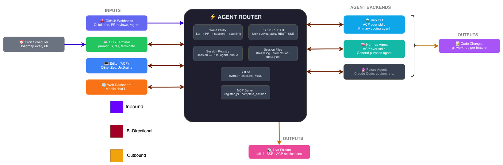

# Agent Router

A daemon that bridges GitHub events to AI coding agents.

When a check fails, when someone leaves a review comment, when CI returns red — Agent Router catches the webhook, decides whether it's worth waking an agent, and routes it to a persistent agent session bound to that PR. The agent fixes things, pushes commits, and merges when CI is green. You watch from a terminal, or check on it from your phone.

It's TypeScript, single-user, runs on your own machine behind a Cloudflare tunnel. MVP today; will be rewritten in Rust once the architecture is validated.

## What it does for you

**Catches GitHub events you'd otherwise have to triage.** Failed CI, review comments, `/agent` commands in PR threads. Each event flows through a wake policy that decides whether it's actionable and whether the author is trusted enough to direct an agent.

**Maintains persistent agent sessions per PR.** When a session is bound to a PR, every event for that PR routes back to the same conversation. Context accumulates. The agent remembers what it's been working on across days of intermittent feedback.

**Trust-tiered wake policy out of the box.** Repository owners and CI bots wake the agent on any event. Collaborators wake the agent only when they prefix a comment with `/agent`. Untrusted commenters never wake the agent. No allowlist to maintain — trust comes from `comment.author_association` on every webhook payload.

**Observable everything.** Every session writes append-only NDJSON to `~/.agent-router/sessions/<id>/stream.log`. Plain `tail -f` works. Multiple terminals can watch the same session. No special client, no auth, no API.

**Agent-agnostic.** Drives Kiro CLI today via the Agent Client Protocol over stdio. Anything that speaks ACP can be swapped in.



## Quick start

You need: Node.js 20+, git, a GitHub repo you control, a personal access token, and Kiro CLI installed somewhere.

```bash
# 1. Install
git clone https://github.com/gspivey/agent-router && cd agent-router
npm install

# 2. Configure
cp config.example.json config.json
# Edit config.json — set kiroPath and your repos

export GITHUB_WEBHOOK_SECRET="your-secret-here"

# 3. Set up the cloudflared tunnel
./scripts/setup-tunnel.sh
# In another terminal:
cloudflared tunnel run agent-router

# 4. Add the webhook on your GitHub repo
# Settings → Webhooks → Add webhook
#   Payload URL: https://<tunnel-id>.cfargotunnel.com/webhook
#   Content type: application/json
#   Secret: same value as GITHUB_WEBHOOK_SECRET
#   Events: Check runs, Issue comments, Pull request review comments

# 5. Install the MCP config so Kiro can talk back to the daemon
./scripts/install-mcp-config.sh

# 6. Run it
npm run dev
```

You're now listening for webhooks. Test it:

```bash
echo "Look at PR #1 and fix the failing CI check" | agent-router prompt --new
```

Or fire one quietly and tail it:

```bash
SESSION_ID=$(echo "Fix CI" | agent-router prompt --new --quiet)
agent-router tail "$SESSION_ID"
```

## Configuration reference

All values can be hardcoded or read from environment variables using `"ENV:VAR_NAME"` syntax. Copy `config.example.json` as a starting point.

```jsonc
{
  // Required — port for the incoming GitHub webhook server
  "port": 3000,

  // Required — global HMAC-SHA256 secret for verifying webhook payloads.
  // Used as the fallback for any repo that doesn't have its own webhookSecret.
  "webhookSecret": "ENV:GITHUB_WEBHOOK_SECRET",

  // Required — absolute path to the Kiro CLI executable
  "kiroPath": "/path/to/kiro",

  // Optional — default GitHub PAT used for any repo without its own token.
  "defaultGithubToken": "ENV:GITHUB_TOKEN",

  // Optional — rate limiting between wakes for the same PR (default: 60s)
  "rateLimit": {
    "perPRSeconds": 60
  },

  // Optional — session lifetime controls (all have defaults shown below)
  "sessionTimeout": {
    "inactivityMinutes": 5,       // kill session if silent for this long
    "maxLifetimeMinutes": 120,    // hard cap regardless of activity
    "gracePeriodAfterMergeSeconds": 60  // extra time after a merge
  },

  // Required — list of repos to monitor
  "repos": [
    {
      // Required — GitHub org or user + repo name
      "owner": "your-org",
      "name": "your-repo",

      // Optional — per-repo GitHub PAT, overrides defaultGithubToken
      "token": "ENV:GH_TOKEN_YOUR_REPO",

      // Optional — per-repo webhook HMAC secret, overrides top-level webhookSecret.
      // Set this when each GitHub repo webhook is configured with a different secret.
      "webhookSecret": "ENV:WEBHOOK_SECRET_YOUR_REPO",

      // Optional — path to a roadmap file in the repo (for future use)
      "roadmapPath": "ROADMAP.md"
    }
  ],

  // Optional — scheduled cron sessions (one per repo per schedule)
  "cron": [
    {
      "name": "nightly-tasks",
      // Standard 5-field cron expression
      "schedule": "0 9 * * 1-5",
      // Must match an owner/name entry in repos[]
      "repo": "your-org/your-repo",
      // Path to a file whose contents are used as the session prompt on each fire
      "promptFile": "/etc/agent-router/prompts/your-repo.md"
    }
  ]
}
```

**Token resolution:** `repos[i].token` → `defaultGithubToken` → error if neither is set.

**Webhook secret resolution:** `repos[i].webhookSecret` → `webhookSecret`.

## Cron sessions

Cron mode lets the daemon spawn agent sessions on a schedule — no incoming webhook required. On each cron fire, the daemon:

1. Checks if an active session already exists for that repo. If yes, skips (webhook-triggered sessions take precedence; concurrent sessions on the same repo aren't allowed).
2. Checks that the last session for this repo ended in a clean state (`completed`). If it ended `failed` or `abandoned`, skips and logs a warning — manual re-trigger required.
3. Reads the `promptFile` from disk and uses its contents verbatim as the session prompt.
4. Spawns a new session.

**Setup:**

1. Create a prompt file with the standing instructions for the agent (e.g. `/etc/agent-router/prompts/myrepo.md`).
2. Add a `cron` entry in config with `promptFile` pointing to it.

**Example prompt file:**
```
Review the open pull requests in this repo. For any PR with a failing CI check,
investigate the failure, push a fix, and leave a comment explaining what you changed.
```

The same prompt is used on every cron fire. The prompt file can be updated at any time — the daemon reads it fresh on each fire.

**Manual re-trigger:** If a session ends in a non-clean state (failed, abandoned, killed), the cron will not auto-restart. Fix whatever caused the failure, then start a session manually with `agent-router prompt --new` or via the web UI. Once a clean session completes, the cron resumes on its normal schedule.

## Day-to-day commands

```bash
agent-router ls                          # List sessions
agent-router tail <session_id>           # Follow session output (pretty)
agent-router tail <session_id> --raw     # Raw NDJSON stream
agent-router tail <session_id> --prompts # Follow prompts log
```

`agent-router ls` truncates session IDs to their first 8 characters for column width. Other commands accept the truncated form as a prefix when there's no ambiguity.

## How it works

```
GitHub webhook → POST /webhook → HMAC verify → event log (SQLite)
    → wake policy: event type filter → PR resolution → session lookup → trust tier check → rate limit
    → compose prompt → spawn Kiro CLI via ACP → stream output to session files
```

The daemon exposes a Unix domain socket for the CLI. Sessions are managed in-memory with NDJSON state on disk. Each session gets its own working directory under `~/.agent-router/sessions/`. The MCP server (one instance per session) lets the agent call back to the daemon to register PRs and signal completion.

## Supported events

| Event | Trust tier check | Action |
|---|---|---|
| `check_run` (completed) | none — always wake | Wake agent for any conclusion (success/failure/etc.) |
| `pull_request_review_comment` (created) | applied | Wake by trust tier rules |
| `issue_comment` (created) | applied | Wake by trust tier rules |

**Trust tier rules for comment events:**

- **Tier 1** (repo owner OR `github-actions[bot]`): wake on any comment body
- **Tier 2** (MEMBER / COLLABORATOR): wake only when body starts with `/agent`
- **Tier 3** (everyone else): never wake

All other event types are logged and ignored.

## Project structure

```
src/
├── index.ts          # Entry point: config → logger → DB → servers → shutdown
├── config.ts         # Config loading, ENV: resolution, validation
├── db.ts             # SQLite schema, prepared statements, query helpers
├── log.ts            # Structured NDJSON logger
├── server.ts         # Hono HTTP: POST /webhook, HMAC verification
├── router.ts         # Wake policy pipeline, trust tier computation
├── queue.ts          # Per-session FIFO event queues
├── prompt.ts         # Prompt composition per event type
├── acp.ts            # ACP client: spawn Kiro CLI, JSON-RPC over stdio
├── session-mgr.ts    # Session lifecycle: spawn, inject, register PR, terminate
├── session-files.ts  # Session directory layout, atomic meta writes, NDJSON append
├── cli-server.ts     # Unix domain socket for CLI IPC
├── mcp-server.ts     # MCP server per session for agent-to-daemon tools
└── errors.ts         # FatalError, EventError, WakeError
```

## Testing

Three tiers, run independently:

```bash
npm test                  # Tier 1 (unit) + Tier 2 (fake backends) — seconds
npm run test:watch        # Tier 1 only with file watching
npm run test:integration  # Tier 3 (real GitHub + real Kiro) — minutes
npm run test:all          # All three tiers
```

Tier 1 covers pure logic with property tests via `fast-check`. Tier 2 exercises the full daemon against fake backends (`FakeGitHubBackend` with a real local git repo, `FakeKiroBackend` with scriptable ACP scenarios). No network access, no real API tokens required for either.

Tier 3 runs against real GitHub and a real Kiro CLI installation. Set these environment variables:

| Variable | Description |
|---|---|
| `GITHUB_TOKEN` | A GitHub PAT with `repo` scope for the scratch test repo |
| `GITHUB_TEST_REPO` | The scratch repo in `owner/repo` format |
| `GITHUB_WEBHOOK_SECRET` | The webhook secret configured on the scratch repo |
| `WEBHOOK_URL` | The public URL for webhook delivery (your tunnel + `/webhook`) |
| `KIRO_PATH` | Absolute path to the Kiro CLI executable |

Tests skip gracefully if the required environment variables are not set. Tier 3 tests are slow (minutes) and consume real API quota — run before shipping, not on every change.

## Maintenance

**Session cleanup.** Session directories accumulate under `~/.agent-router/sessions/`. To prune sessions older than 30 days:

```bash
find ~/.agent-router/sessions -maxdepth 1 -mtime +30 -exec rm -rf {} +
```

Run periodically via cron. Active sessions are not affected — only directories whose modification time is older than 30 days are removed.

**Database.** SQLite at `~/.agent-router/agent-router.db`, WAL mode. No manual maintenance required. The daemon checkpoints WAL on graceful shutdown.

**Logs.** The daemon logs structured NDJSON to stdout, captured by systemd journal in production. Per-session logs live in the session directory and are cleaned up alongside the session.

## Where things are going

- **`PRODUCT.md`** — what the product is and the open architecture questions.
- **`ROADMAP.md`** — phased plan: production stability → ACP server → web dashboard → multi-repo sandboxing → swappable agent backends.
- **`BACKLOG.md`** — tactical near-term bug list and small specs (kept separate from the strategic roadmap).
- **`AGENTS.md`** — conventions for agents (and humans) working in this codebase.

## Why not [Hermes](https://hermes-agent.nousresearch.com/)?

Reasonable question for anyone in the agent-platform space. Hermes is a general-purpose AI agent platform with a [GitHub webhook adapter](https://hermes-agent.nousresearch.com/docs/user-guide/messaging/webhooks). On paper, it covers a lot of the same ground.

Hermes is a Swiss army knife — 18 messaging adapters, a skill marketplace, voice mode, RL training, memory systems, 47 tools across 19 toolsets. Agent Router is a scalpel: route GitHub events to persistent coding agent sessions, period.

What Hermes does that overlaps:

- Webhook intake with HMAC-SHA256 verification
- Filter by event type
- Compose prompts from payloads via templates
- Rate limiting and idempotency
- Deliver responses to chat platforms or GitHub PR comments

What Hermes can't do that Agent Router needs:

- **PR-scoped persistent sessions.** Hermes creates a fresh agent per webhook event. Agent Router maintains a `(repo, PR) → session` mapping so events accumulate context.
- **Session-aware wake policy.** Agent Router only wakes if a session is registered for the PR. Hermes fires for every matching webhook.
- **Trust-tiered wake.** Author-association-based filtering against prompt injection from untrusted commenters.
- **Per-session event queuing.** Multiple events for the same PR processed sequentially in order.
- **ACP lifecycle management.** Full Kiro subprocess control: spawn, init, load session, inject, stream, timeout, crash recovery.
- **File-based session streaming.** Append-only NDJSON for `tail -f` from any terminal.

Bolting these onto Hermes via plugins would mean fighting its architecture. Hermes' webhook adapter is intake feeding a general-purpose agent loop; Agent Router's value is everything *after* intake.

The two are orthogonal. You could run both — Hermes for general agent work and notifications, Agent Router for deterministic GitHub-to-coding-agent routing. They don't need to talk to each other.

## License

MIT