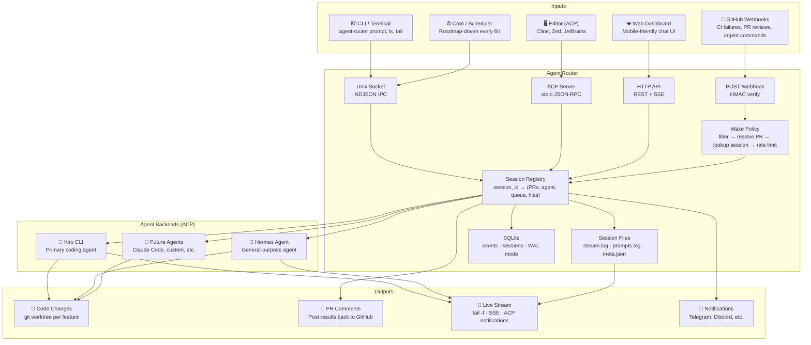

# Agent Router — Architecture Diagram

## Mermaid (paste into mermaid.live or GitHub markdown)

## Image Prompt (for AI image generators or designers)

> A network routing diagram rendered in a clean, modern technical illustration style with a dark background. At the center is a glowing hexagonal hub labeled "Agent Router" — it looks like a physical network switch or router with ports on all sides, emitting subtle light trails.
>
> On the left side, five input cables connect to the router:
> - A purple cable from a GitHub octocat icon (webhooks)
> - A green cable from a terminal/CLI icon
> - A blue cable from a code editor icon (VS Code/Zed)
> - An orange cable from a phone/browser icon (web dashboard)
> - A gray cable from a clock icon (cron scheduler)
>
> On the right side, three output cables fan out to agent icons:
> - A bright blue cable to a Kiro robot icon
> - A teal cable to a Hermes brain icon
> - A dimmed cable to a "?" icon (future agents)
>
> Below the router, a small SQLite database icon and streaming log files glow softly.
>
> The overall aesthetic is: circuit board meets network topology diagram. Clean lines, no clutter, the router is clearly the central hub that everything passes through. The word "ROUTER" is subtly emphasized — this is a routing device, not an agent.
>
> Style references: Vercel's architecture diagrams, Cloudflare's network maps, Linear's product illustrations.
